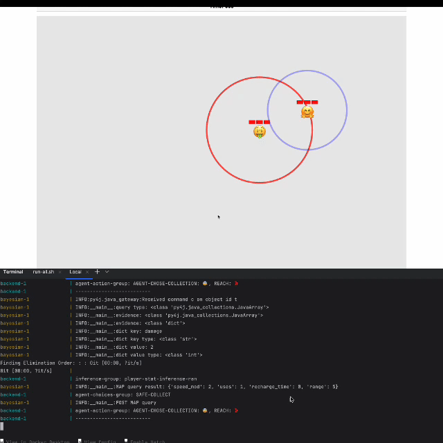

# Game Of Points

A Simple game where a human user competes an against AI agent in a battle to collect the most points and survive.

>**✏️ NOTE**
> 
>*This project was created for educational purposes. The main goal was to explore and play around with various technologies, including bayes nets, neural nets, rule engines, and conversational agent tools.*

<p align="center">
  
</p>

## 📖 Full docs

### Here: [https://rchdev.github.io/game-of-points/](https://rchdev.github.io/game-of-points/)

## 🗂️ Table of contents
- [🎲 Game Rules](#-game-rules)
- [🏗️ Project overview](#%EF%B8%8F-project-overview)
- [🌀 Weird parts](#-weird-parts)
- [📋 Environment setup](#-environment-setup)
- [⚙️ Project setup](#%EF%B8%8F-project-setup)
- [🚀 Launching the project](#-launching-the-project)
---

## 🎲 Game Rules
1. Game starts with 60s timer. Once the time runs out, whoever (agent or player) collected the most points - wins.
2. Points appear at random locations and time intervals.
3. Both the agent and the user start with a random weapon that affects stats like damage, speed, recharge time, and usage count.
4. Whoever kills the other - wins.

## 🏗️ Project overview

### Main system components:

>**ℹ️ INFO**
>
>*More info can be found in [Deep Lore](https://rchdev.github.io/game-of-points/deep-lore/) section of the docs.*

1. [Front-end](https://github.com/rchDev/game-of-points/tree/main/game-of-points-fe) application. A javascript project using vite for bundling p5.js for drawing on canvas. Sends player actions to **Game server**. Receives authoritative game state from the **game server**. Also talks with **Google's conversational agent**.
2. [Game server](https://github.com/rchDev/game-of-points/tree/main/game-of-points-be). A Java Quarkus server project that's using [Drools](https://www.drools.org/) rule engine as a backbone for its reasoning process. The server acts as a platform to run AI for many game front-ends. It is responsible for processing player actions, reasoning, validating **Google's conversational agent's** intents.
3. [Bayesian network](https://github.com/rchDev/game-of-points/tree/main/bayes-net) server. A Python [pgmpy](https://pgmpy.org/index.html) Bayesian network project, used for filling gaps in game agent's knowledge, through providing most probable state variable combination queries.
4. [Sentiment classifier](https://github.com/rchDev/game-of-points/tree/main/sentiment-classifier) server. A Python [Keras](https://keras.io/) neural network project, used for assigning a class to player's mood description.
5. [Google's conversational agent](https://conversational-agents.cloud.google.com/projects). Used for collecting information about the player before the match begins.
6. [Ngrok](https://ngrok.com/) is used as a tunnel service for connecting Google's conversational agent to a local game server.


## 🌀 Weird parts

>**✏️ NOTE**
> 
>*All bugs can be solved by restarting stuff...*

This project was created for educational purposes.
It is in no way "production ready".
There are a bunch of unhandled edge cases, bugs and quirky behaviours as well as creative, but objectively bad problem solutions.

Some rendering bugs:
1. The front-end to back-end game state reconciliation sometimes breaks and the game becomes laggy...
2. Game timer updates too slow - timer is tied to game update cycle when the server fails to process game state updates fast enough, timer updates lag too.
3. Error messages get rendered incorrectly in Mozilla browsers.

Ohh and the game has no end state...

## 📋 Environment setup

### Everyone:

**Step 1:** Have Git version control installed.

**Step 2:** Install Git LFS (Large File Storage).

Install and setup instructions can be found here: ["Installing Git Large File Storage"](https://docs.github.com/en/repositories/working-with-files/managing-large-files/installing-git-large-file-storage).

>**✏️ NOTE**
>
>*Steps 3 and 4 are optional if you want a working conversational to question a player before the game starts.
The game will work without this step.*

**Step 3 (Optional):** Have a working Google's Conversational Agent (~~Dialogflow CX~~).

>**✏️ NOTE**
> 
>*[Here](https://rchdev.github.io/game-of-points/conv-agent-config/) you can find a full guide on how to set up a conversational agent for this project on Google's platform.*

1. Inside project's root directory you'll find a file: **exported_agent_snitch.blob**
2. Take this file and import it into your own: [Google conversational agent](https://conversational-agents.cloud.google.com/projects) project.
3. Publish your agent and use provided: *project-id*, *agent-id* in:

```shell
npm run update-bot-ids -- --project-id=<project_id> --agent-id=<agent_id>

# Should print success message similar to this one:
✔ Updated project‑id and agent‑id in index.html
```

**Step 4 (Optional):** Have **ngrok** installed and configured with your account.

Used for exposing your local game server to
Google's conversational agent's webhook,
without hosting the game server yourself.

```shell
ngrok --version

# Should print version info similar to this: 
ngrok version 3.20.0
```

### Docker specific (Recommended) ⭐ ⭐ ⭐

**Step 1:** Have docker engine installed and accessible from your terminal

```shell
docker --version

# Should print version info similar to this: 
Docker version 28.0.4, build b8034c0
```

### Non docker setup (Not recommended) ☠️ ☠️ ☠️

This takes a lot of hassle to get up and working.

Tested on: macOS 15.4.1, Ubuntu 24.04, Windows WSL2 Ubuntu.


>**‼️WARNING**
> 
>*Won't work on Windows 11 x64. **Reason:** 18 python packages used in a project didn't have wheels for Windows Python versions: 3.8-3.13. I didn't want to play around with versions, so I used Docker.*

**Step 1:** Make sure *JDK* 17-22 is installed.

>**‼️WARNING**
>
>*Java 23 is not supported and will cause compatibility issues. Some maven packages won't build.*

```shell
java --version 

# Should print version info similar to this one:
openjdk 17.0.14 2025-01-21 LTS
OpenJDK Runtime Environment Corretto-17.0.14.7.1 (build 17.0.14+7-LTS)
OpenJDK 64-Bit Server VM Corretto-17.0.14.7.1 (build 17.0.14+7-LTS, mixed mode, sharing)

# and

javac --version

#Should also print version info:
javac 17.0.14
```

**Step 2:** Have Python ==3.12 installed.

Best bet is to have the version that is specified in [.python-version](https://github.com/rchDev/game-of-points/blob/main/bayes-net/.python-version) file (use pyenv)

```shell
python --version

# Should print a python version:
Python 3.12.9
```

**Step 3:** Install Node.js >=v16.20.2.

```shell
node --version

# Should print node version that's >= 16.20.2:
v22.14.0
```

**Step 4 (Optional):** Install Maven 3.2+.

Maven is not required, because Maven will be installed when running one of these scripts:
1. ./mvnw shell command on Mac or Linux
2. mvnw.cmd on Windows

**Step 5 (Optional):** Install IntelliJ IDEA: [macOS](https://www.jetbrains.com/idea/download/?section=mac), [Linux](https://www.jetbrains.com/idea/download/?section=linux), [Windows](https://www.jetbrains.com/idea/download/?section=windows).

Helpful for launching individual project modules and editing project files.

## ⚙️ Project setup

### Docker specific (Recommended) ⭐ ⭐ ⭐

**Step 1:** Download files from Git Large File Storage.

Inside game-of-points project's root run:

```shell
git lfs pull
```

This will download:
1. The player answers database file.
2. The sentiment analysis ML model.
3. Exported conversational agent file.

**Step 2 (Optional):** If you haven't already during the environment setup, connect the front-end application to the conversational agent.

```shell
cd ./game-of-points-fe && \
npm run update-bot-ids -- --project-id=<project_id> --agent-id=<agent_id>

# You should see a success message similar to this one:
✔ Updated project‑id and agent‑id in index.html
```

---

### Non Docker (Not Recommended) ☠️☠️☠️

**Step 1:** Download files from Git Large File Storage.

Inside game-of-points project's root run:

```shell
git lfs pull
```

This will download:
1. The player answers database file.
2. The sentiment analysis ML model.
3. Exported conversational agent file.


**Step 2:** If not already created, create a virtual environment of your choosing, using python version provided in this: [.python-version](https://github.com/rchDev/game-of-points/blob/main/sentiment-classifier/.python-version) file.

**Example with [venv](https://docs.python.org/3/library/venv.html) and [pyenv](https://github.com/pyenv/pyenv):**

Inside projects root run:

```shell
cd ./bayes-net && \
pyenv local && \
python -m venv venv/
```
**Step 3:** Activate virtual environment and install dependencies that are specified inside the requirements.txt file.

```shell
source .venv/bin/activate
pip install requirements.txt
```

**Step 4:** Change directories to /game-of-points/sentiment-classifier and create another virtual environment there.

**Example with [venv](https://docs.python.org/3/library/venv.html) and [pyenv](https://github.com/pyenv/pyenv):**

```shell
cd ../sentiment-classifier && \
pyenv local && \
python -m venv venv/
```

**Step 5:** Once again, activate the virtual environment and install dependencies that are specified inside the requirements.txt file, only this time inside /game-of-points/sentiment-classifier directory:

```shell
source .venv/bin/activate && \
pip install requirements.txt
```

**Step 6:** We need to set up the front-end. So we change into the /game-of-points/game-of-points-fe and run: ``npm install``.

Here, we change into front-end module's directory and run npm install to install all dependencies:
```shell
cd ../game-of-points-fe && \
npm install
```

**Step 7 (Optional):** If you haven't already during the environment setup, connect the front-end application to the conversational agent.

```shell
cd ./game-of-points-fe && \
npm run update-bot-ids -- --project-id=<project_id> --agent-id=<agent_id>

# You should see a success message similar to this one:
✔ Updated project‑id and agent‑id in index.html
```

## 🚀 Launching the project

Once you've set up the environment and the project, you can launch the whole application in a few ways, by following instructions bellow.

### General launch rules:

1. Game server depends on working python services (bayes-net and sentiment classifier).
2. Game front-end depends on a working game server.
3. The Player data collection step in front-end chat depends on **ngrok** tunnel (if you are not hosting your back-end on public ip address).
   If your conversational agent's webhook isn't pointing to your back-end's public address, game server won't receive user questionnaire results.

### Docker specific launch (Recommended) ⭐ ⭐ ⭐

**Step 1 (Optional):** Run ngrok, if you want your local game back-end communicating with the Google's conversational agent.

In a terminal session run:
```shell
ngrok http --domain=<your_public_domain> 8080
```

**Step 2:** Run the [docker-compose.yml](https://github.com/rchDev/game-of-points/blob/main/docker-compose.yml) file.

Inside project's root, open a new terminal session (while keeping the ngrok session alive) and run:
```shell
docker compose up

# or for detached version

docker compose up -d

# or if you want to fully rebuild all containers from their images

docker compose up --build
```

After this you can open a front-end at: `` http://localhost:5173 ``

### Non Docker Launch ☠️ ☠️ ☠️

>**✏️ NOTE**
>
>*Works only on: macOS, Linux and Windows WSL.*

---

### Using run-all.sh script

**Step 1 (Optional):** Run ngrok, if you want your local game back-end communicating with the Google's conversational agent.

In a terminal session run:
```shell
ngrok http --domain=<your_public_domain> 8080
```

**Step 2:** Run [run-all.sh](https://github.com/rchDev/game-of-points/blob/main/run-all.sh) script.

In another terminal session, run:

```shell
bash run-all.sh

# You should see a bunch of similar messages.

⏳ Launching bayes-net and sentiment classifier services...
Connection to localhost port 25334 [tcp/*] succeeded!
Connection to localhost port 25336 [tcp/*] succeeded!
✅ Bayes-net and sentiment classifier are ready!
⏳ Launching game backend...
Connection to localhost port 8080 [tcp/http-alt] succeeded!
✅ Game backend is ready.
⏳ Launching game frontend...

> game-of-points-fe@0.0.0 dev
> vite


  VITE v6.2.6  ready in 49 ms

  ➜  Local:   http://localhost:5173/
  ➜  Network: use --host to expose
  ➜  press h + enter to show help
```

---

### Using manual labor

>**✏️ NOTE**
> 
>*Use these steps only if you want to run a specific part of the project, or if `` run-all.sh `` and Docker approaches are not working.*

All these steps should be performed from project's root directory.

**Step 1:** Run bayes-net.

>**✏️ NOTE**
> 
>*Example shown with [venv](https://docs.python.org/3/library/venv.html), but you can use any virtual environment, or none (good luck with that).*

```shell
cd ./bayes-net && \
source .venv/bin/activate && \
python bayesian_network.py
```

**Step 2:** Run sentiment classifier.

Open a new terminal session in project's root, don't kill the previous where bayes-net is running.

>**✏️ NOTE**
> 
>*Example shown with [venv](https://docs.python.org/3/library/venv.html), but you can use any virtual environment, or none (good luck with that).*

```shell
cd ./sentiment-classifier && \
source .venv/bin/activate && \
python sentiment_classifier.py predict
```

**Step 3:** Run game server.

In a new terminal session (keep others alive):

```shell
cd ./game-of-points-be && \
./mvnw quarkus:dev
```

**Step 4 (Optional):** Run **ngrok**, if you want your local game back-end communicating with the Google's conversational agent.

In a new terminal session (keep others alive):

```shell
ngrok http --domain=<your_public_domain> 8080
```

**Step 5:** Run game front-end.

In a new terminal session (keep others alive):

```shell
cd ../game-of-points-fe && \
npm run dev
```
