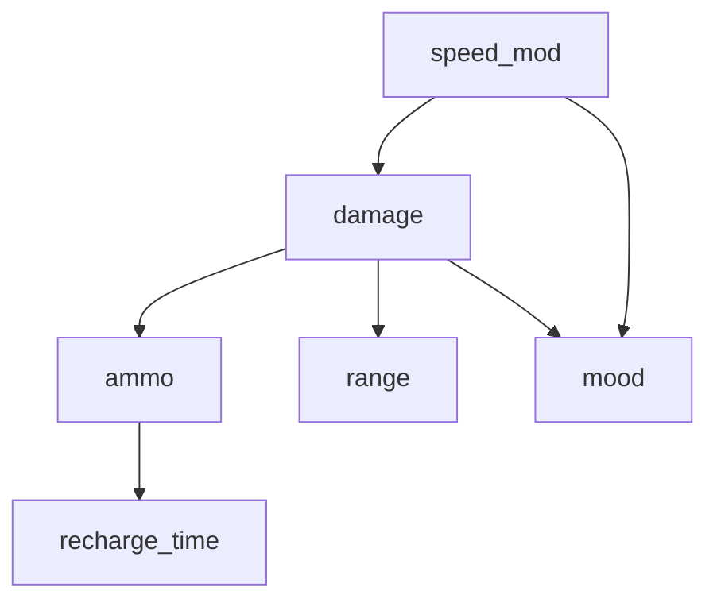
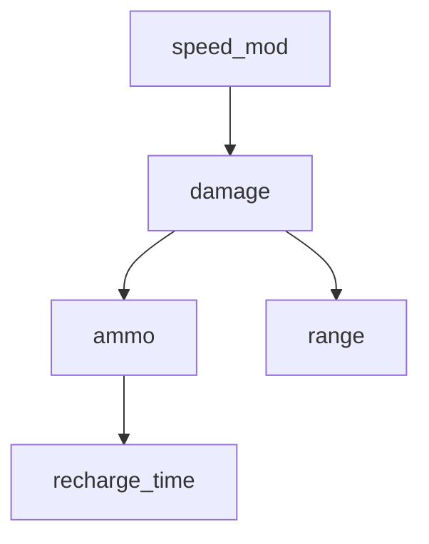

## Bayesian network

Drools rule engine gains information about player's stats from facts, but not all info can be known right away, at the start of a game.
Most of the time, rules engine has only partial information about the player stats,
while the agent's capability assessment process heavily depends on having complete information.
The Solution to this partial information problem is **Bayesian network**.

Known stats are presented as **evidence** and unknown ones are given as **query** variables.

# Main use:

The main use for a Bayes net in my application is to: **get the most probable combination of player stats.**

## Used libraries:

[pgmpy (Probabilistic Graphical Models using Python)](https://pgmpy.org/) - Python library designed for working with probabilistic graphical models (PGMs) such as Bayesian Networks and Markov Networks.

[py4j (A Bridge between Python and Java)](https://www.py4j.org/) - Py4J enables Python programs running in a Python interpreter to dynamically access Java objects in a Java Virtual Machine.

**pgmpy** was used for creating the actual bayes network in python [seen here](https://github.com/rchDev/game-of-points/blob/main/game-of-points-be/src/main/java/io/rizvan/beans/actors/agent/bayesian_network.py),
but the game server, where this Bayes net will be used, is written in Java. So i used **py4j** library to translate and the exchange JVM objects with Python interpreter.

For **py4j** to work, it needs a Gateway server on the Python side, that runs on some port and listens on another,
then on Java side you instantiate a Gateway server which, at the point of calling:

```java
bayesGatewayServer.getPythonServerEntryPoint(
        new Class[]{ BayesPythonManager.class }
);
```

creates a connection between two servers.

{: .note }
The Python-side server must be running before the Java-side server, as the server on the Java side initiates the connection. Since the class seen in the code sample bellow, is instantiated during the Java game server startup, the Python servers must be up and running before the Java game server starts.

```java
@Singleton
@Startup
public class PythonGateway {
    private GatewayServer bayesGatewayServer;
    private GatewayServer sentimentGatewayServer;
    private BayesPythonManager bayesManager;
    private SentimentPythonManager sentimentPythonManager;

    @PostConstruct
    public void init() {

        bayesGatewayServer = new GatewayServer(
                null,                    // entryPoint
                25333,                   // port
                25334,                   // pythonPort
                GatewayServer.defaultAddress(),  // address
                GatewayServer.defaultAddress(),  // pythonAddress
                GatewayServer.DEFAULT_CONNECT_TIMEOUT,  // connectTimeout
                GatewayServer.DEFAULT_READ_TIMEOUT,     // readTimeout
                null                      // customCommands
        );
        bayesGatewayServer.start();

        // Initialize the Sentiment Gateway Server with its own Python and callback ports
        sentimentGatewayServer = new GatewayServer(
                null,
                25335,
                25336,
                GatewayServer.defaultAddress(),  // address
                GatewayServer.defaultAddress(),  // pythonAddress
                GatewayServer.DEFAULT_CONNECT_TIMEOUT,  // connectTimeout
                GatewayServer.DEFAULT_READ_TIMEOUT,
                null
        );
        sentimentGatewayServer.start();

        bayesManager = (BayesPythonManager) bayesGatewayServer.getPythonServerEntryPoint(new Class[]{BayesPythonManager.class});
        sentimentPythonManager = (SentimentPythonManager) sentimentGatewayServer.getPythonServerEntryPoint(new Class[]{SentimentPythonManager.class});
    }

    public BayesPythonManager getBayesNetwork() {
        return bayesManager;
    }

    public SentimentPythonManager getSentimentAnalyser() {
        return sentimentPythonManager;
    }
}
```

**What is BayesPythonManager?**
It's an interface that defines a contract which is implemented on the Python side. Concretely, it defines Bayesian network methods that are implemented inside [bayesian_network.py](https://github.com/rchDev/game-of-points/blob/main/bayes-net/bayesian_network.py) script and will be used inside the Java game server. 
Under the hood, this interface is probably used to inform **py4j's** serializers and mappers about implemented: function signatures, data types, variable names an so on.
```java
...
public interface BayesPythonManager {
    void add_nodes(List<String> nodes);

    void add_edges(List<String[]> edges);

    void add_cpd(String variable, int variable_card, double[][] values, String[] evidence, int[] evidence_card);

    void finalize_model();

    Map<String, Integer> map_query(String[] query, String[][] evidence);
}
```

You pass it to a gateway server on the Java side and get an object, which contains all those methods that you can then use to call the actual Bayes-net that lives on the Python side.
```java
public class PythonGateway {
    ...
    @PostConstruct
    public void init() {
        ...
        bayesManager = (BayesPythonManager) bayesGatewayServer.getPythonServerEntryPoint(new Class[]{BayesPythonManager.class});
        ...
    }
    ...
}
```

An example usage of of a BayesPythonManager:
```java
public class DroolsBrain implements AgentsBrain {
    // ...
    private final BayesPythonManager bayesNetwork;
    // ...
    public DroolsBrain(
        PythonGateway pythonGateway,
        Optional<PlayerAnswers> playerAnswers,
        List<WeaponEntity> weaponMoodOccurrences
    ) {
        // ...
        bayesNetwork = pythonGateway.getBayesNetwork();
        // ...
        bayesNetwork.add-nodes(nodes);
        // ...
    }
}
```

A Python method that was called from the Java side:
```python
class BayesianNetworkManager:
    ...
    def add_nodes(self, nodes):
        """
        Funkcija prideda nauja atsitiktini kintamaji i Bajeso tinkla
        :param nodes:
        :return:
        """
        try:
            nodes = list(nodes.toArray())
            logger.info(f"Adding nodes: {nodes}")
            self.model.add_nodes_from(nodes)
            logger.info("Nodes added successfully.")
        except Exception as e:
            logger.error(f"Error adding nodes: {e}")
            raise
    ...
```
## Construction:

Now that we have Python objects available to us on the Java, we can use methods:
1. add_nodes
2. add_edges
3. add_cpd
4. finalize_model
to construct the Bayes-net.

Bayesian network gets created inside DroolsBrain class,
during agent's creation, when a game session gets initialized.

Network is created by using weapon cache data and player answers database, which consists of weapon-mood combinations.

There are two version of a network: the one with a mood node and the one without it.
Which version get created depends on multiple factors, such as:
1. Did the system receive the player mood answer from the conversational agent's session during the game session initialization phase:
    - yes - check the other condition,
    - no - create bayes net without mood variable.
2. Does the player answers database contain all the possible damage and speed values.
   It is important that it does, because mood variable depends on speed and damage variables,
   so you cannot connect mood with speed and damage if some of the value combinations are missing.
    - yes - create a network with a mood variable.
    - no - create a network without a mood variable.

### Construction process:

1. Go through the whole weapon list, **count** how many times each value of every weapon stat showed up.
2. Divide stat counts by the total weapon count, to get **marginal stat probabilities**.
3. If the stat is fully independent, we already have all the info we need.
4. Otherwise, when the weapon stat is only conditionally independent while knowing some other stat, we count how many times did the query-evidence combo occur and divide the occurence count by the total number of weapons.
This way we get joint probabilities: P(query, evidence). To get the P(query | evidence), we divide joint probabilities by the marginal probability of evidence: P(evidence).
   At the end of this we get CPD table in a form of matrix, that we, then feed into the **add_cpd** function. Function with the calculations can be found here: [getConditionalProbabilities()](https://github.com/rchDev/game-of-points/blob/main/game-of-points-be/src/main/java/io/rizvan/beans/actors/agent/DroolsBrain.java#L358-L411).
5. Once the probability calculations are done, all nodes are added to the network by calling bayesNetwork.add_nodes() and passing it the nodes list.
6. After adding the nodes, we connect all the nodes by calling bayesNetwork.add_edges() and passing it a list of string arrays, each containing related nodes.
7. We call an [addMoodNode](https://github.com/rchDev/game-of-points/blob/main/game-of-points-be/src/main/java/io/rizvan/beans/actors/agent/DroolsBrain.java#L107-L199) function, which conditionally adds mood node if all the weapon: speed and damage values have showed up at least once.

## Usage
{: no_toc }

I'm using the Bayes net inside one of inference layer Drools rules. What this rule does is query the Bayes net to get the most probable stat combination and uses those values to update variables inside the AgentKnowledge class.
Each AgentKnowledgeItem inside AgentKnowledge has value and and a boolean indicating if that value is known or approximated. Items become known, only when they are experienced by an agent during the gameplay.
Items that have been set by the Bayes net, have their values set, but are not considered unknown. 
This means that the values derived from experience take precedence over values that were derived from the Bayes net.

When querying the Bayes net, known values from the AgentKnowledge get set as a list of **evidence variables** and unknown values are converted into a list of **query variables**.
These lists containing query and evidence values are then passed into a bayesPythonManager

**What's really going on:**

Inside a rule, updateKnowledge callable gets called with queries and evidence.
```java
rule "player-stat-inference"
agenda-group "inference-group"
salience -100
    when
        $knowledge : AgentKnowledge()
        $getQueryList : GetQueriesCallable()
        $getEvidenceList : GetEvidenceCallable()
        $updateKnowledge: UpdateKnowledgeCallable()
    then
        String[] queries = (String[]) $getQueryList.call();
        String[][] evidence = (String[][]) $getEvidenceList.call();

        $updateKnowledge.setParameters(queries, evidence);
        $updateKnowledge.call();
        System.out.println("inference-group: player-stat-inference-ran");
end
```

UpdateKnowledgeCallable then calls updateKnowledge() function with two lists: query, evidence.
```java
public class UpdateKnowledgeCallable implements Callable<Void> {
    private String[] query;
    private String[][] evidence;

    public void setParameters(String[] query, String[][] evidence) {
        this.query = query;
        this.evidence = evidence;
    }

    @Override
    public Void call() {
        updateKnowledge(query, evidence);
        return null;
    }
}
```

Inside updateKnowledge() function, a Bayesian network on the Python side is called. This call returns a hash map of key value pairs, where key is the name of a player stat e.g. damage, reload speed... and the value - weapon stat value index.
Then the function loops over every entry inside a map and uses the received name and value index to derive the actual stat value and set the value of the corresponding knowledge item inside the AgentKnowledge object.
```java
private void updateKnowledge(String[] query, String[][] evidence) {
    Map<String, Integer> mapResult = bayesNetwork.map_query(query, evidence);
    for (var entry : mapResult.entrySet()) {
        var index = entry.getValue();
        var statName = entry.getKey();
        var weaponStat = Weapon.Stat.fromName(statName);
        switch (statName) {
            case "damage":
            var damageValue = (Integer) conditionals.queryValues.get(weaponStat).get(index);
            knowledge.setPlayerDamage(damageValue, false);
            // WAY MORE CASES BELLOW
        }
        // WAY MORE LOGIC BELLOW
    }
}
```

```python
```

## Bayes net versions:
{: .no_toc }

### Version 1 (with mood)



### Version 2 (without mood)


