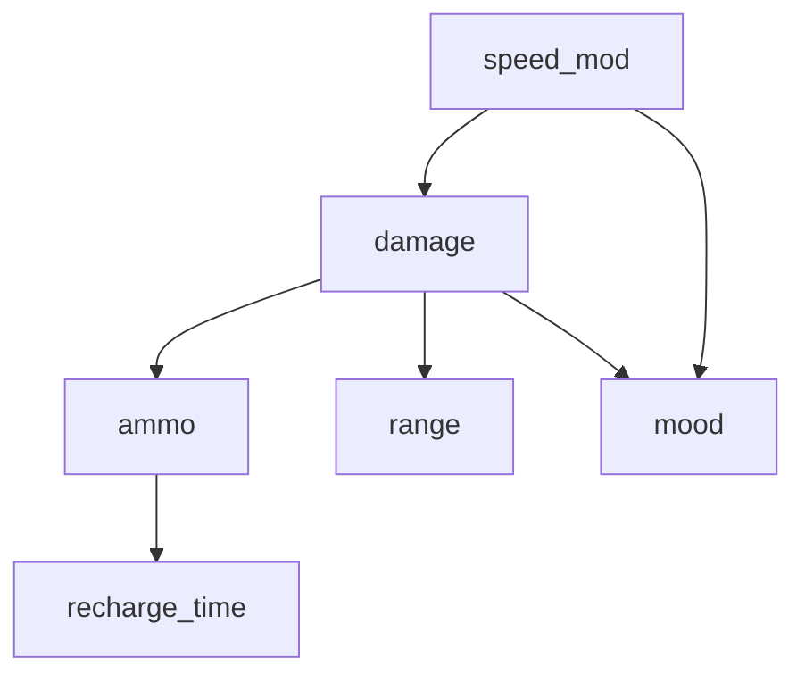
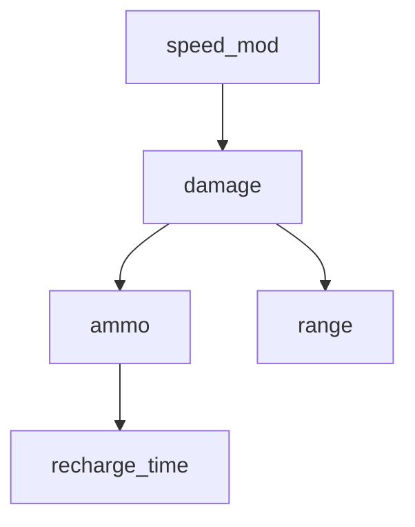

# Bayesian network

Drools rule engine gains information about player's stats from facts, but not all info can be known right away, at the start of a game.
Most of the time, rules engine has only partial information about the player stats,
while the agent's capability assessment process heavily depends on having complete information.
The Solution to this partial information problem is **Bayesian network**.

Known stats are presented as **evidence** and unknown ones are given as **query** variables.

### Main use:

The main use for a Bayes net in my application is to: **get the most probable combination of player stats.**

### Used libraries:

[pgmpy (Probabilistic Graphical Models using Python)](https://pgmpy.org/) - Python library designed for working with probabilistic graphical models (PGMs) such as Bayesian Networks and Markov Networks.

[py4j (A Bridge between Python and Java)](https://www.py4j.org/) - Py4J enables Python programs running in a Python interpreter to dynamically access Java objects in a Java Virtual Machine.

**pgmpy** was used for creating the actual bayes network in python [seen here](https://github.com/rchDev/game-of-points/blob/main/game-of-points-be/src/main/java/io/rizvan/beans/actors/agent/bayesian_network.py),
but the game server, where this Bayes net will be used, is written in Java. So i used **py4j** library to translate and the exchange JVM objects with Python interpreter.

For **py4j** to work, it needs a Gateway server on the Python side, that runs on some port and listens on another,
then on Java side you instantiate a Gateway server which, at the point of calling:

```java
bayesGatewayServer.getPythonServerEntryPoint(
        new Class[]{ BayesPythonManager.class }
);
```

creates a connection between two servers.

{: .note }
The Python-side server must be running before the Java-side server, as the server on the Java side initiates the connection. Since the class seen in the code sample bellow, is instantiated during the Java game server startup, the Python servers must be up and running before the Java game server starts.

```java
@Singleton
@Startup
public class PythonGateway {
    private GatewayServer bayesGatewayServer;
    private GatewayServer sentimentGatewayServer;
    private BayesPythonManager bayesManager;
    private SentimentPythonManager sentimentPythonManager;

    @PostConstruct
    public void init() {

        bayesGatewayServer = new GatewayServer(
                null,                    // entryPoint
                25333,                   // port
                25334,                   // pythonPort
                GatewayServer.defaultAddress(),  // address
                GatewayServer.defaultAddress(),  // pythonAddress
                GatewayServer.DEFAULT_CONNECT_TIMEOUT,  // connectTimeout
                GatewayServer.DEFAULT_READ_TIMEOUT,     // readTimeout
                null                      // customCommands
        );
        bayesGatewayServer.start();

        // Initialize the Sentiment Gateway Server with its own Python and callback ports
        sentimentGatewayServer = new GatewayServer(
                null,
                25335,
                25336,
                GatewayServer.defaultAddress(),  // address
                GatewayServer.defaultAddress(),  // pythonAddress
                GatewayServer.DEFAULT_CONNECT_TIMEOUT,  // connectTimeout
                GatewayServer.DEFAULT_READ_TIMEOUT,
                null
        );
        sentimentGatewayServer.start();

        bayesManager = (BayesPythonManager) bayesGatewayServer.getPythonServerEntryPoint(new Class[]{BayesPythonManager.class});
        sentimentPythonManager = (SentimentPythonManager) sentimentGatewayServer.getPythonServerEntryPoint(new Class[]{SentimentPythonManager.class});
    }

    public BayesPythonManager getBayesNetwork() {
        return bayesManager;
    }

    public SentimentPythonManager getSentimentAnalyser() {
        return sentimentPythonManager;
    }
}
```

**What is BayesPythonManager?**
It's an interface that defines a contract which is implemented on the Python side. Concretely, it defines Bayesian network methods that are implemented inside [bayesian_network.py](https://github.com/rchDev/game-of-points/blob/main/bayes-net/bayesian_network.py) script and will be used inside the Java game server. 
Under the hood, this interface is probably used to inform **py4j's** serializers and mappers about implemented: function signatures, data types, variable names an so on.
```java
...
public interface BayesPythonManager {
    void add_nodes(List<String> nodes);

    void add_edges(List<String[]> edges);

    void add_cpd(String variable, int variable_card, double[][] values, String[] evidence, int[] evidence_card);

    void finalize_model();

    Map<String, Integer> map_query(String[] query, String[][] evidence);
}
```

You pass it to a gateway server on the Java side and get an object, which contains all those methods that you can then use to call the actual Bayes-net that lives on the Python side.
```java
public class PythonGateway {
    ...
    @PostConstruct
    public void init() {
        ...
        bayesManager = (BayesPythonManager) bayesGatewayServer.getPythonServerEntryPoint(new Class[]{BayesPythonManager.class});
        ...
    }
    ...
}
```

An example usage of of a BayesPythonManager:
```java
public class DroolsBrain implements AgentsBrain {
    ...
    private final BayesPythonManager bayesNetwork;
    ...
    public DroolsBrain(
        PythonGateway pythonGateway,
        Optional<PlayerAnswers> playerAnswers,
        List<WeaponEntity> weaponMoodOccurrences
    ) {
        ...
        bayesNetwork = pythonGateway.getBayesNetwork();
        ...
        bayesNetwork.add-nodes(nodes);
    }
}
```

A Python method that was called from the Java side:
```python
class BayesianNetworkManager:
    ...
    def add_nodes(self, nodes):
        """
        Funkcija prideda nauja atsitiktini kintamaji i Bajeso tinkla
        :param nodes:
        :return:
        """
        try:
            nodes = list(nodes.toArray())
            logger.info(f"Adding nodes: {nodes}")
            self.model.add_nodes_from(nodes)
            logger.info("Nodes added successfully.")
        except Exception as e:
            logger.error(f"Error adding nodes: {e}")
            raise
    ...
```
### Construction:

Now that we have Python objects available to us, we can use methods:
1. add_nodes
2. add_edges
3. add_cpd
4. finalize_model

to construct the Bayes-net.


Bayesian network gets created inside DroolsBrain class,
during agent's creation, when a game session gets initialized.

Network is created by using weapon cache data and player answers database, which consists of weapon-mood combinations.

There are two version of a network: one with mood node and one without it.
Which version get created depends on multiple factors, such as:
1. Did we receive player mood answer from the conversational agent session during the session initialization phase:
    - yes - check the other condition,
    - no - create bayes net without mood variable.
2. Does the player answers database contain all possible damage and speed values.
   Mood variable depends on speed and damage variables,
   so you cannot connect mood with speed and damage if some of the values are missing,
   unless you create a truncated speed/damage variable.
    - yes - create with mood variable.
    - no - create without mood variable.

**Construction process:**

1. Go through the whole weapon list, **count** how many times each value of every weapon stat showed up.
2. Divide stat counts by the total weapon count to get the **marginal probability** of that stat showing up.
3. If the stat is fully independent, we already have all the info we need.
4. Otherwise, when weapon stat is only conditionally independent while knowing some other stat, we count how many times did the query-evidence combo occur and divide the count by the total number of weapons. This way we get joint probability: P(query, evidence). To get P(query | evidence), we divide joint probability by marginal probability of evidence: P(evidence).
   At the end of this we get conditional probability distribution table in a form of matrix, that we could then feed into **add_cpd** function.

{: .note}
There's a bunch of additional stuff going on this function. Most of it is just convenience metadata.
In an instance when we can add mood variable

```java
    private ConditionalResult getConditionalProbabilities(
        List<Weapon> weapons,
        MarginalResult marginalResult,
        List<Pair<Weapon.Stat, Weapon.Stat>> conditionalRelations
) {
        // evidence -> query -> cpd for evidence-query     
        HashMap<Weapon.Stat, HashMap<Weapon.Stat, double[][]>> statCPDs = new HashMap<>();
        
        // query and evidence values stored separately for convenient access later
        HashMap<Weapon.Stat, List<Number>> statQueryValues = new HashMap<>();
        HashMap<Weapon.Stat, List<Number>> statEvidenceValues = new HashMap<>();

        for (var relation : conditionalRelations) {
            var queryStat = relation.getFirst();
            var evidenceStat = relation.getSecond();

            var queryValues = marginalResult.values.get(queryStat);
            var evidenceValues = marginalResult.values.get(evidenceStat);

            // Init conditional probability distribution table from query-evidence pair
            double[][] cpd = new double[queryValues.size()][evidenceValues.size()];
            for (int i = 0; i < queryValues.size(); i++) {
                for (int j = 0; j < evidenceValues.size(); j++) {
                    cpd[i][j] = 0.0;
                }
            }

            // Count how many times each query-evidence combo occur
            for (var weapon : weapons) {
                int queryIndex = queryValues.indexOf(weapon.getStat(queryStat));
                int evidenceIndex = evidenceValues.indexOf(weapon.getStat(evidenceStat));

                cpd[queryIndex][evidenceIndex]++;
            }

            // Calculate conditional prob P(query|evidence) by:
            // 1. computing joint probability P(query,evidence) by dividing query-evidence occurrences by total weapon count
            // 2. dividing joint probability by the marginal probability of P(evidence) to get P(query|evidence)
           for (int i = 0; i < queryValues.size(); i++) {
                for (int j = 0; j < evidenceValues.size(); j++) {
                    var evidenceProb = marginalResult.probabilities.get(evidenceStat).get(j);
                    cpd[i][j] /= weapons.size();
                    cpd[i][j] /= evidenceProb;
                }
            }

           var statCPDValues = new HashMap<Weapon.Stat, double[][]>();
           statCPDValues.put(evidenceStat, cpd);
           statCPDs.put(queryStat, statCPDValues);
           statQueryValues.put(queryStat, queryValues);
           statEvidenceValues.put(evidenceStat, evidenceValues);
        }
        
        return new ConditionalResult(statQueryValues, statEvidenceValues, statCPDs);
    }
```

5. We add all nodes to the network by calling bayesNetwork.add_nodes() and passing it nodes list.
6. We connect all the nodes by calling bayesNetwork.add_edges() and pass a list of string lists of each containing a related nodes.
7. We call [**addMoodNode**](https://github.com/rchDev/game-of-points/blob/main/game-of-points-be/src/main/java/io/rizvan/beans/actors/agent/DroolsBrain.java#L107-L199) method, which conditionally adds mood node if all weapon: speed and damage values have shown up at least once.

### Versions:
{: .no_toc}

**Version 1 (with mood)**



**Version 2 (without mood)**


