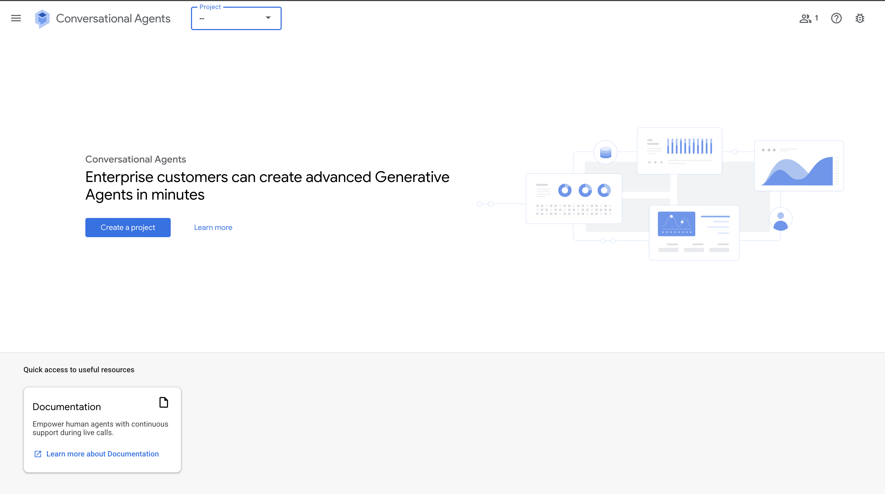

# Configuring the conversational agent

{: .note }
*This guide was written 2025-04-22*

## Steps

1. Go to <a href="https://conversational-agents.cloud.google.com/projects" target="_blank">Conversational agents console</a> and select: **create a project**.

2. Choose project's name and press **create**.

3. You will be redirected to newly created project's dashboard. Select: **go to APIs overview**.

4. In **APIs & services** select: **enable APIs and services**.

5. Find and choose: **Dialogflow API**.

6. Choose: **enable**.

7. You will be redirected to Dialogflow APIs' page.

8. Go back to Conversational agents console under your project and press: **Create agent**.

9. Choose name, timezone and language, select **Flow** as conversation start and press **Create**.

10. Once the new agent gets created, you might be redirected to its dashboard, go back to the console, press: **three dots** and select: the **restore** option.

11. Upload a file: **exported_agent_snitch.blob** that can be found inside project's root directory and press **Restore**.

12. You will be redirected to agents dashboard, where you can see newly imported agent.

13. In side menu, select **Flows** and then select **Manage** tab. 

14. Inside a **Manage** tab, select **Webhooks** section and enter your own public server address with a path to /info-validation resource on a server.

15. Select: **Publish agent**, unauthenticated access (for dev purposes only), choose: **Side panel** ui style (doesn't matter really) and press **Enable Conversational Messenger**.

16. Now your agent will be available for outside use and you will get access to project-id and agent-id variables that will be used during npm install.


Now you have a working conversational agent, but game frontend doesn't know which agent it should be communicating with.
For this purpose i've made a simple script that can be ran on its own or during npm install and it will modify index.html file to insert ids into their places.

{: .info}
>During front-end setup, run:
>```shell
>npx cross-env PROJECT_ID=<conversational_agent_project_id> AGENT_ID=<conversational_agent_id> npm install && \
>```


