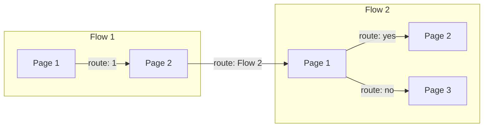
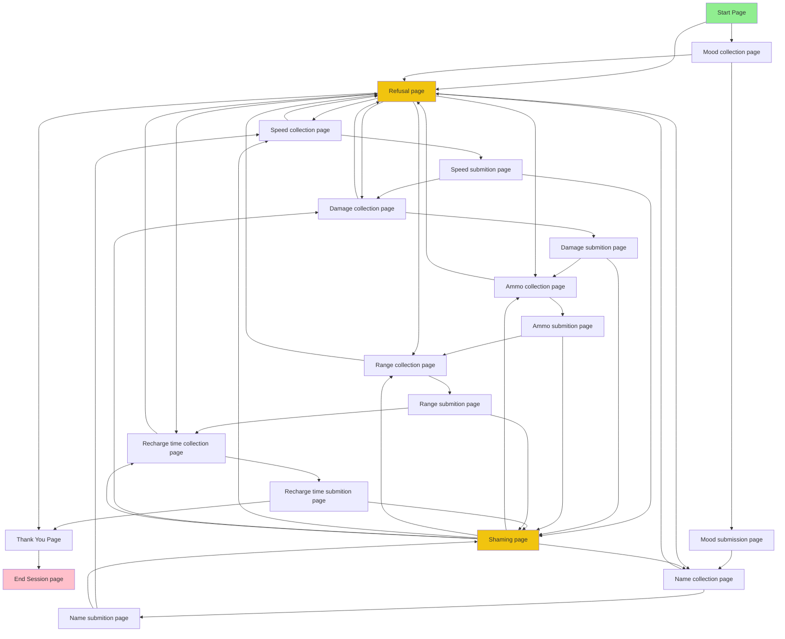
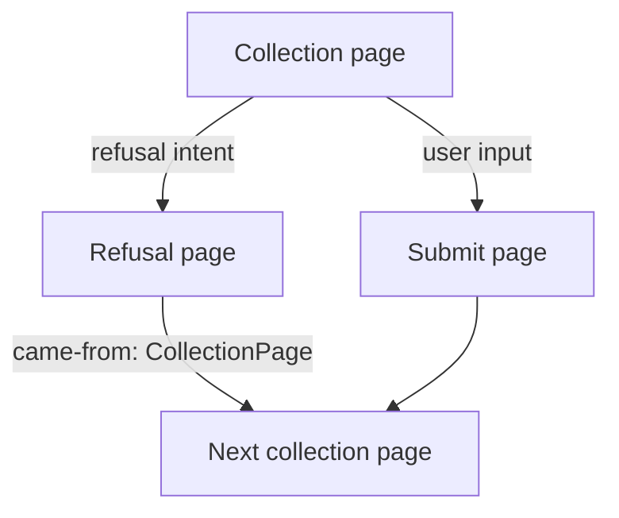

# **Conversational Agent (Google)**

This project uses Google's flow conversational agent, formerly Dialogflow CX to question the player and collect relevant weapon stat data.

## How does it work?

### Overview

Flow based conversational agent is comprised of multiple **flows**, containing varying amount of **pages**. 

**Pages can contain these building blocks:**
1. **Parameters** that provide a way of exchanging information between pages. They can be received from environment or other pages.
2. **Routes** that get triggered when the user **intent** is matched or some logical condition is met.
3. **Webhooks** - code that runs and calls web resources that live outside the system.
4. **Intents** that categorize user's needs and allow making logical decisions based on those needs.
5. **Entry fullfilment messages** that display text to a user on a page transition.
6. Various other building blocks...

### Confession flow pages

The diagram looks really messy, but the bread and butter of this flow are the two following page types: ***collection*** and ***submition***, to be more exact - their combinations.
Collection pages receive user messages and match them against their intents. If the user has expressed the ***refusal intent***, a route transitions to a ***Refusal page***, otherwise the message is sent to the game server to validate and after that, sent to the corresponding ***Submition page***, where one of two routes get triggered:
1. If the data validation fails - transition to ***shaming page***.
2. Otherwise, if the data validation succeeds - transition to other ***collection page***.

***Shaming page*** - is a collection of user shaming messages and routes that transition to submition equivalent collections pages. All submition pages have a route to the same ***shaming page***. 
The shaming page is imformed about the origin of arrival with the ***comes-from*** parameter, that is set by the route that makes the transition to the ***shaming page***. 
Example of failed submition flow, that illustrates the role of a ***shaming page***:

***Refusal page*** - displays a transitional message to a user and routes to the following data collection page, until the ending page is reached. Example of refusal flow:

### Example confessional flow:

1. Dialogflow client, inside a front-end application, sends user message to conversational agent server.
2. Server interprets the message and matches it against intents found inside ***Default Start Flow*** page.
3. It finds: ***Default Welcome Intent*** and runs code inside it.
4. Agent response like, - "Hi, would you like to talk about the upcoming match?" gets sent to the front-end and the server transions to the ***Confession Flow's*** start page,
5. This page waits for the user input, matches it against it's intents: yes, no. In this example, yes intent gets hit.
6. ***Yes*** intent performs a transition to ***User mood collection page***.
7. ***User mood collection*** page's code gets executed and send the message, - *"What’s your mood going into the match?"* to the front-end.
8. Once the user response there are only two intents in this page: refusal and user mood status updated. Lets say user refuses to disclose his mood information and ***refuse*** intent gets hit.
9. Refuse intent sets parameter: ***came-from*** to a value: *"your mood"* and transitions to a ***Refusal page***.
10. Refusal page sends a message to front-end client and based on the parameter's: ***came-from*** value, selects a route which, in this case, transitions from a ***Refusal page*** to a ***Weapon name collection*** page.
11. Lets say, user refuses to answer almost every question, except for ***Weapon recharge time collection*** page's question.
12. Once the player sends a message to the server, one of the page's conditional routes: *$page.params.weapon-recharge-time.status == UPDATED* - activates.
13. Once this route runs, it sends a input validation request to the game server and after receiving the response - transitions to ***Weapon recharge time submission*** page.
14. Inside the submission page, there are two routes based on a session param that was set by the game server validation response. WEAPON_RECHARGE_TIME.
15. If the recharge time was set by the game server, the user is redirected to ***Thank you page***, otherwise parameter: ***came-from*** is set to a value of: *"weapon recharge time"* and the user is sent to the ***Shaming page***.
16. If the user gets redirected to the ***Shaming page*** from a ***Weapon recharge time page***, message like this: *"I think you lied about the weapon recharge time."* gets sent to the front-end client and route $session.params.came-from == "weapon recharge time" executes, and redirects user back to the ***Weapon recharge time collection page***.
17. If the user reaches ***Thank you page***, message: *"Thank you for taking the time to answer these questions."* along with the chat session end code gets sent to the front-end. Client then informs the rest of front-end application about the session end, the chat window closes and the game starts.
