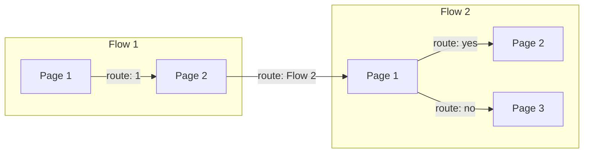

# **Conversational Agent (Google)**

This project uses Google's flow conversational agent, formerly Dialogflow CX to question the player and collect relevant weapon stat data.

## How does it work?

### Overview

Flow based conversational agent is comprised of multiple **flows**, containing varying amount of **pages**. 

**Pages can contain these building blocks:**
1. **Parameters** that are a way of exchanging information between pages. They can be received from environment or other pages.
2. **Routes** that get triggered when the user **intent** is matched or some logical condition is met.
3. **Webhooks** - code that runs and calls web resources that live outside the system.
4. **Intents** that categorize user's needs and allow making logical decisions based on those needs.
5. **Entry fullfilment messages** that display text to a user on a page transition.
6. Various other building blocks...

### Example flow:

1. During the game setup (pre-game), if the player chooses to participate in the questioning, conversational agent gets activated for the particular client.
