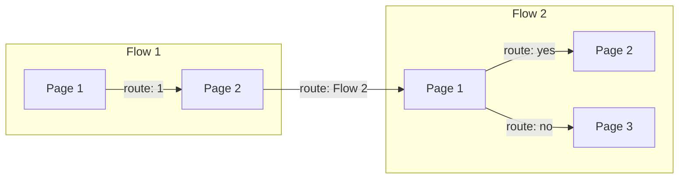

# **Conversational Agent (Google)**

This project uses Google's flow conversational agent, formerly Dialogflow CX to question the player and collect relevant weapon stat data.

## How does it work?

### Overview

Flow based conversational agent is comprised of multiple **flows**, containing varying amount of **pages**. 

**Pages can contain these building blocks:**
1. **Parameters** that provide a way of exchanging information between pages. They can be received from environment or other pages.
2. **Routes** that get triggered when the user **intent** is matched or some logical condition is met.
3. **Webhooks** - code that runs and calls web resources that live outside the system.
4. **Intents** that categorize user's needs and allow making logical decisions based on those needs.
5. **Entry fullfilment messages** that display text to a user on a page transition.
6. Various other building blocks...

### Example confessional flow:

1. Dialogflow client, inside a front-end application, sends user message to conversational agent server.
2. Server interprets the message and matches it against intents found inside ***Default Start Flow*** page.
3. It finds: ***Default Welcome Intent*** and runs code inside it.
4. Agent response like, - "Hi, would you like to talk about the upcoming match?" gets sent to the front-end and the server transions to the ***Confession Flow's*** start page,
5. This page waits for the user input, matches it against it's intents: yes, no. In this example, yes intent gets hit.
6. ***Yes*** intent performs a transition to ***User mood collection page***.
7. ***User mood collection*** page's code gets executed and send the message, - *"What’s your mood going into the match?"* to the front-end.
8. Once the user response there are only two intents in this page: refusal and user mood status updated. Lets say user refuses to disclose his mood information and ***refuse*** intent gets hit.
9. Refuse intent sets parameter: ***came-from*** to a value: *"your mood"* and transitions to a ***Refusal page***. 
10. During the game setup (pre-game), if the player chooses to participate in the questioning, conversational agent gets activated for the particular client.
