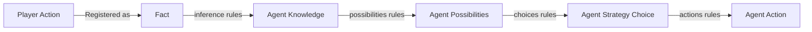

# Agent Reasoning
{: .no_toc }

An overview of how the agent makes decisions.

## Table of contents
{: .no_toc .text-delta }

- TOC
{:toc}

---

## Overview

### Reasoning participants
{: .no-toc}

- **GameState** - a class containing variables which hold information about game environment. Also has methods for validating and applying **PlayerActions** and **AgentActions**, also stores information about **Player** and **Agent** (positions, hp, speed, weapon uses count...)
- **AgentPossibilities** - (add later.)
- **AgentChoice** - (add later.)
- **AgentAction** - interface that defines **apply(GameState) -> void** and **getType() -> ActionType** methods. Concrete implementations of this class have various GameState altering effects that spring into action when **apply** method is called.
- **PlayerAction** - (add later.)
- **Facts** - validated, applied and registered player actions, that happened since the last **agent.reason()** method call.
- **AgentKnowledge** - Agent doesn't have direct access to **GameState**. So this class acts as a collection of gathered truths about the game environment during the course of game and is used in agents decision making.
- **AgentsBrain** - interface which defines a contract for creating various types of agents. Its centerpoint is a **reason** method, which takes in a **GameState** as an argument and applies changes to it.
- **DroolsBrain** - concrete implementation of **AgentsBrain** which uses Drools rule engine and a Bayes net to make gameplay decisions.

### A Journey from player action to agent action
{: .no_toc }



```mermaid
block-beta
   columns 5
   A space B space C
   space space space space space
   F space E space D

   A[Player Action] -->|Registered as| B[Fact]
   B --> C
   C --> D
   D --> E
   E --> F
```


## Reasoning process

The reasoning starts once the GameUpdateScheduler updates the game state, 
inserts facts into a facts storage and calls agent's reason method.  

## Drools Rules

## Bayesian network