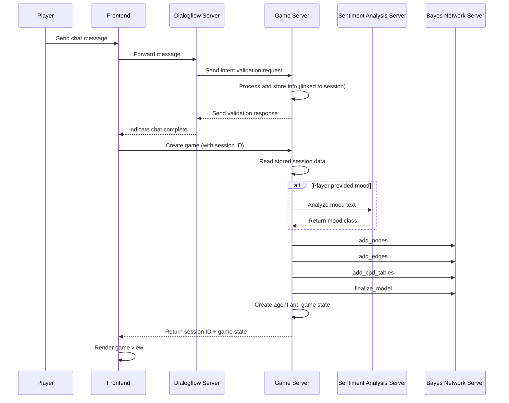
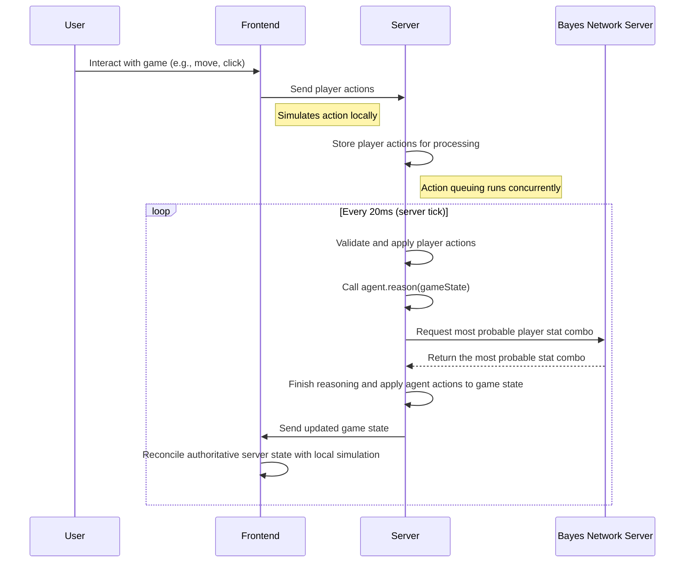
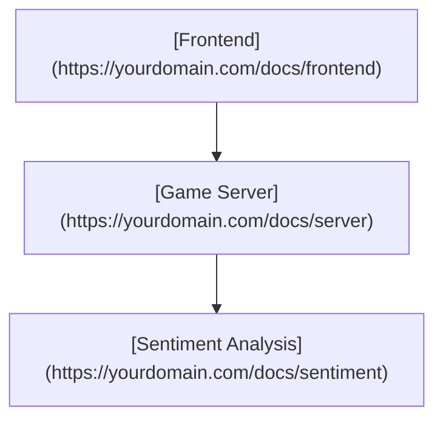

# Deep lore

Delve deeper into the inner workings of a project

## Overview of what's going on:

**Questioning before a game match action sequence:**

**Gameplay and reasoning action sequence:**

## Testing links
