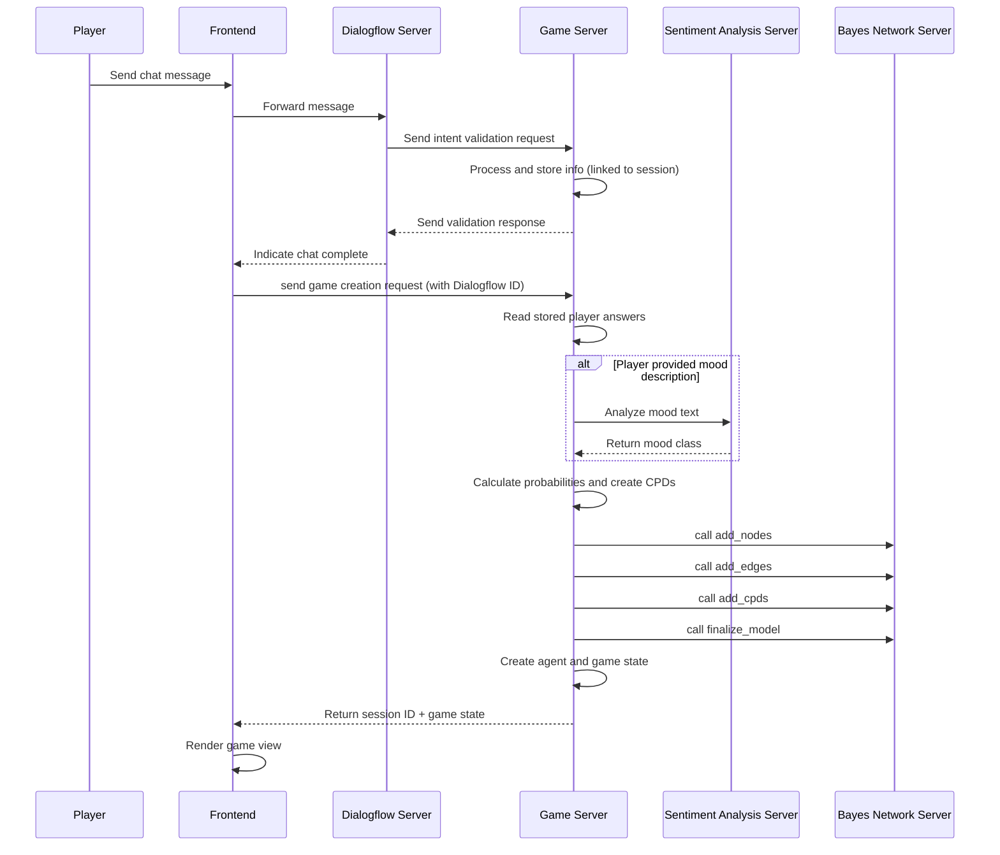
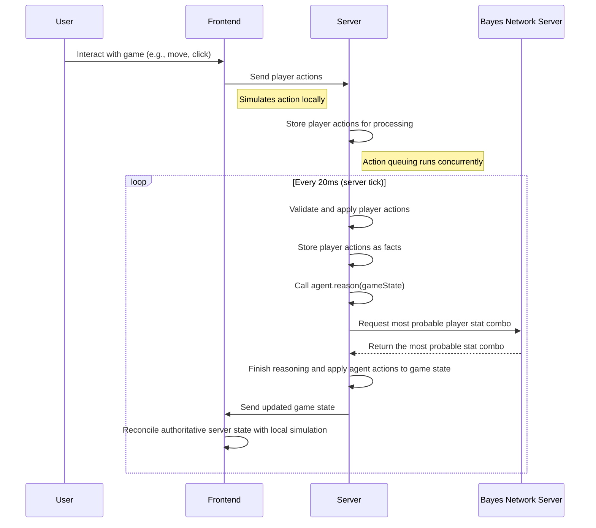

# Deep lore

Delve deeper into the inner workings of a project

- TOC
{:toc}

---

## Overview of what's going on:

**Full game initialization sequence:**

```mermaid
sequenceDiagram
    participant Player
    participant Frontend
    participant Dialogflow as Dialogflow Server
    participant GameServer as Game Server
    participant Sentiment as Sentiment Analysis Server
    participant Bayes as Bayes Network Server

    %% Chat interaction
    Player ->> Frontend: Send chat message
    Frontend ->> Dialogflow: Forward message
    Dialogflow ->> GameServer: Send intent validation request
    GameServer ->> GameServer: Process and store info (linked to session)
    GameServer -->> Dialogflow: Send validation response

    %% Chat continues until end page
    Dialogflow -->> Frontend: Indicate chat complete

    %% Game creation
    Frontend ->> GameServer: send game creation request (with Dialogflow ID)
    GameServer ->> GameServer: Read stored player answers
    alt Player provided mood description
        GameServer ->> Sentiment: Analyze mood text
        Sentiment -->> GameServer: Return mood class
    end
    
    GameServer ->> GameServer: Calculate probabilities and create CPDs

    %% Agent + Bayes Net creation
    GameServer ->> Bayes: call add_nodes
    GameServer ->> Bayes: call add_edges
    GameServer ->> Bayes: call add_cpds
    GameServer ->> Bayes: call finalize_model

    GameServer ->> GameServer: Create agent and game state
    GameServer -->> Frontend: Return session ID + game state
    Frontend ->> Frontend: Render game view

```

**Gameplay and reasoning sequence:**

```mermaid
sequenceDiagram
    participant User
    participant Frontend
    participant Server
    participant BayesNet as Bayes Network Server
    
    %% === Continuous Action Flow ===
    User ->> Frontend: Interact with game (e.g., move, click)
    Frontend ->> Server: Send player actions
    note right of Frontend: Simulates action locally
    Server ->> Server: Store player actions for processing
    note right of Server: Action queuing runs concurrently
    
    %% === Periodic Server Tick Loop ===
    loop Every 20ms (server tick)
        Server ->> Server: Validate and apply player actions
        Server ->> Server: Store player actions as facts
        Server ->> Server: Call agent.reason(gameState)
        Server ->> BayesNet: Request most probable player stat combo
        BayesNet -->> Server: Return the most probable stat combo
        Server ->> Server: Finish reasoning and apply agent actions to game state
        Server ->> Frontend: Send updated game state
        Frontend ->> Frontend: Reconcile authoritative server state with local simulation
    end
```