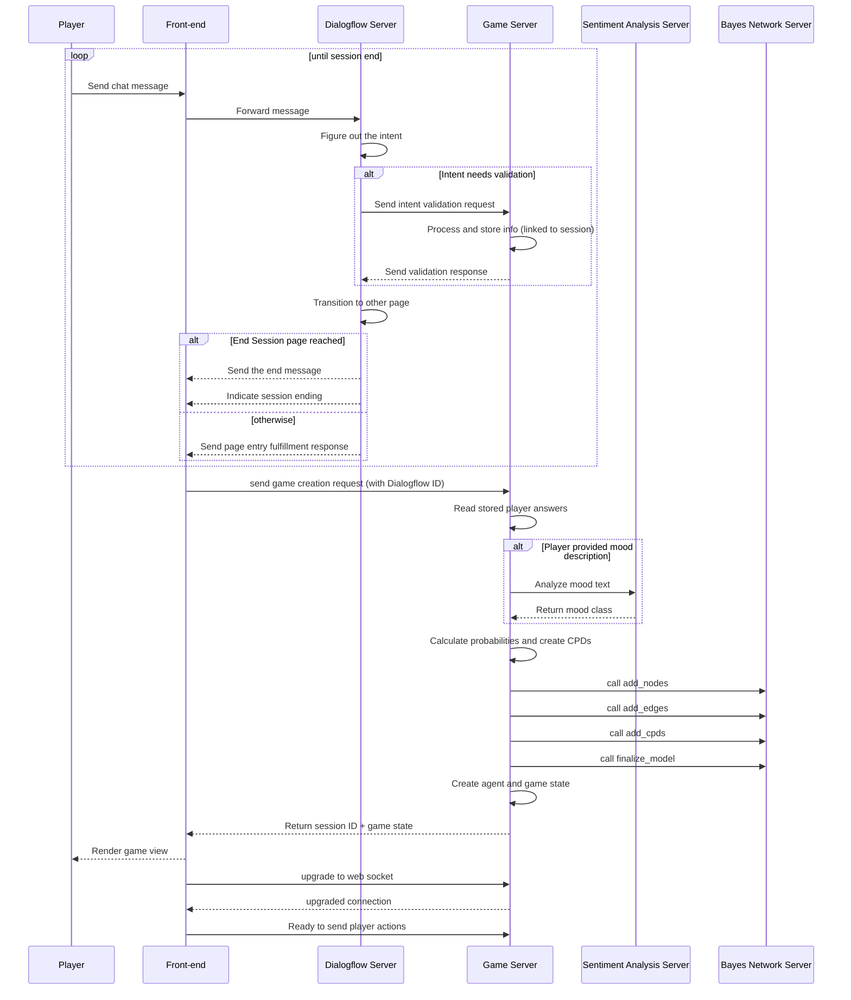
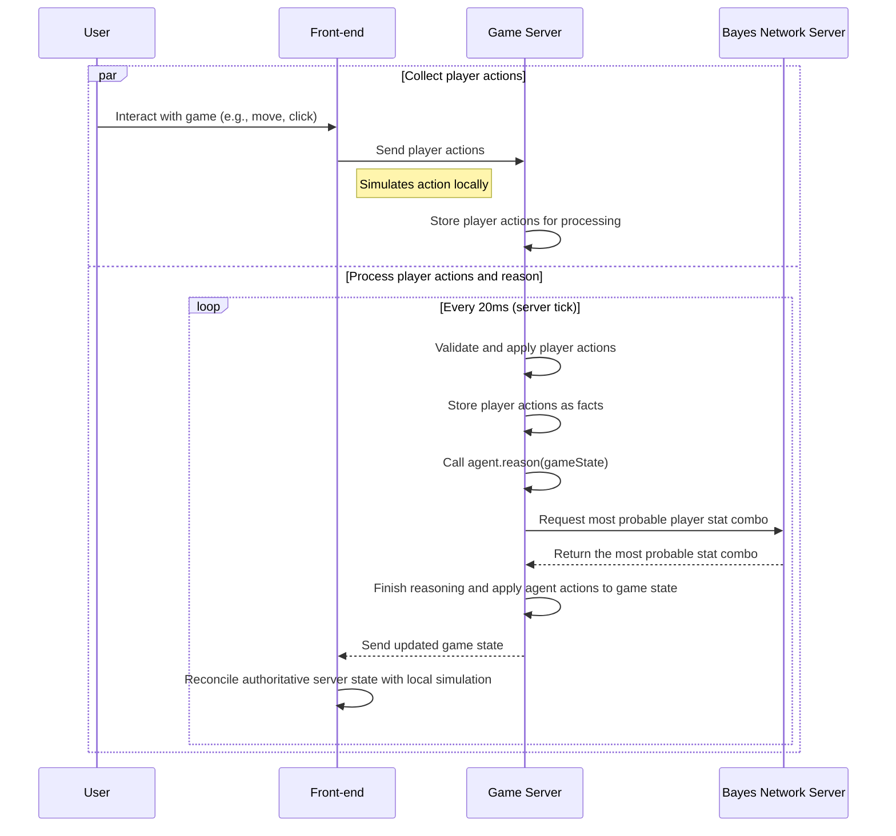

# Deep lore

Delve deeper into the inner workings of a project

## Overview of game initialization sequence:
{: .no_toc }

### What's going on here:
1. The user sends a chat messages to the conversational agent. 
2. The conversational agent extracts intents and validates them through the game server's /info-validation endpoint. 
3. Conversational agent then determines which page or flow should he transition to next and makes the transition. 
4. Upon transition, it validates the transition and checks if it has the session-end page. If it did, it sends:
   - Sends a page entry fulfillment response.
   - Sends a session-end signal.
5. Otherwise, only page's and/or flow's entry fulfillment response is sent.
6. If session hasn't ended, steps 1-5 are repeated.
7. When the chat session ends, the front-end sends game creation request, containing Dialogflow ID to the game server.
8. The game server parses the request and looks up stored player answers that were collected during the chat.
9. The player's answers about weapon stats or its mood will be used during reasoning, when agent makes action decisions.
10. Another important calculation the server performs is **mood extraction**. The server sends user's mood description to the sentiment classifier service - a trained up neural net - to extract its mood class.
11. The mood and speed-damage combo are then stored in the player answers database.
12. Entries from this database, in combination with weapon stache, are then used by the game server to construct a bayes net, which will also be used during reasoning.
13. Once the bayes net is constructed, a reasoning game agent is created.
14. Server then uses newly created agent for creating a new game state for the current game session request. 
15. The server generates a unique session ID and sends it, along with the game state, to the front end.
16. The front-end parses the server response, renders the game state, and, using provided session ID, establishes a websocket connection with the game server.
17. Front-end is now ready to send player actions to the game server.

## Overview of player action processing and reasoning sequence
{: .no_toc }

### What's going on here:
{: .no_toc }

The diagram shows the sequence of actions from the moment the user submits its actions to the moment the server sends processed and updated game state to the front-end.

1. Each user action such as a mouse movement, character movement, weapon use is sent to the server (i know it's a bad idea).
2. While the game server is processing player actions, front-end application simulates these updates to create an illusion of smooth gameplay experience for a user. 
3. Server stores these actions in a application wide sessionStorage. 
4. When the server is ready to process player actions, it launches game update schedulers method: [updateGameState](https://github.com/rchDev/game-of-points/blob/main/game-of-points-be/src/main/java/io/rizvan/GameStateUpdateScheduler.java#L51-L88). Which run a loop through all active game sessions and starts applying updates for each game state. 
5. Inside a sessions loop, updating starts by cloning the current game state. 
6. Then all actions from sessionStorage are retrieved and validated. 
7. Valid actions are then applied and registered as facts. 
8. Once all actions have been processed, agent.reason() method is called with cloned and updated game state. 
9. This method then calls agent brain's [reasoning method](https://github.com/rchDev/game-of-points/blob/main/game-of-points-be/src/main/java/io/rizvan/beans/actors/agent/DroolsBrain.java#L271-L307)
10. Inside brain's reason method a bunch of [Drools](https://www.drools.org/) rule groups get called. They implement the main reasoning logic of this application. Through firing a bunch of rules, agent actions get derived.
11. Those agent actions are applied to the cloned game state. 
12. The updated game state is then placed into session's game state queue and event signaling game state updated is fired. 
13. Controller that's listening for game update catches the signal, create a json response object with the latest state and sends it to front-end application through a websocket connection. 
14. Front-end receives the updated game state and considers it to be authoritative. It reconciles predicted game state with received server state and renders the result.
