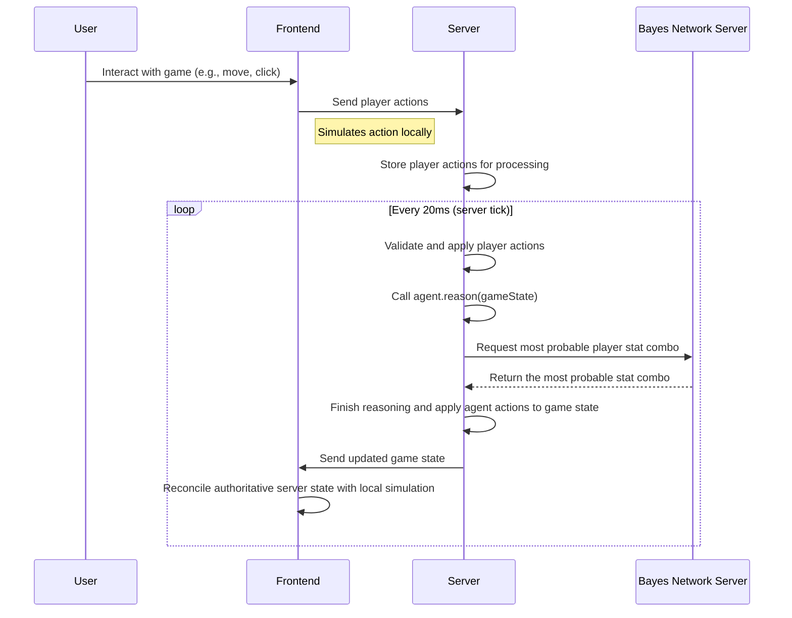

# Deep lore

Delve deeper into the inner workings of a project

**Overview of what's going on:**

```mermaid
sequenceDiagram
    participant User
    participant Frontend
    participant Server
    participant BayesNet as Bayes Network Server

    User ->> Frontend: Interact with game (e.g., move, click)
    Frontend ->> Server: Send player actions
    note right of Frontend: Simulates action locally

    Server ->> Server: Store player actions for processing

    loop Every 20ms (server tick)
        Server ->> Server: Validate and apply player actions
        Server ->> Server: Call agent.reason(gameState)
        Server ->> BayesNet: Request most probable player stat combo
        BayesNet -->> Server: Return the most probable stat combo
        Server ->> Server: Finish reasoning and apply agent actions to game state
        Server ->> Frontend: Send updated game state
        Frontend ->> Frontend: Reconcile authoritative server state with local simulation
    end
```