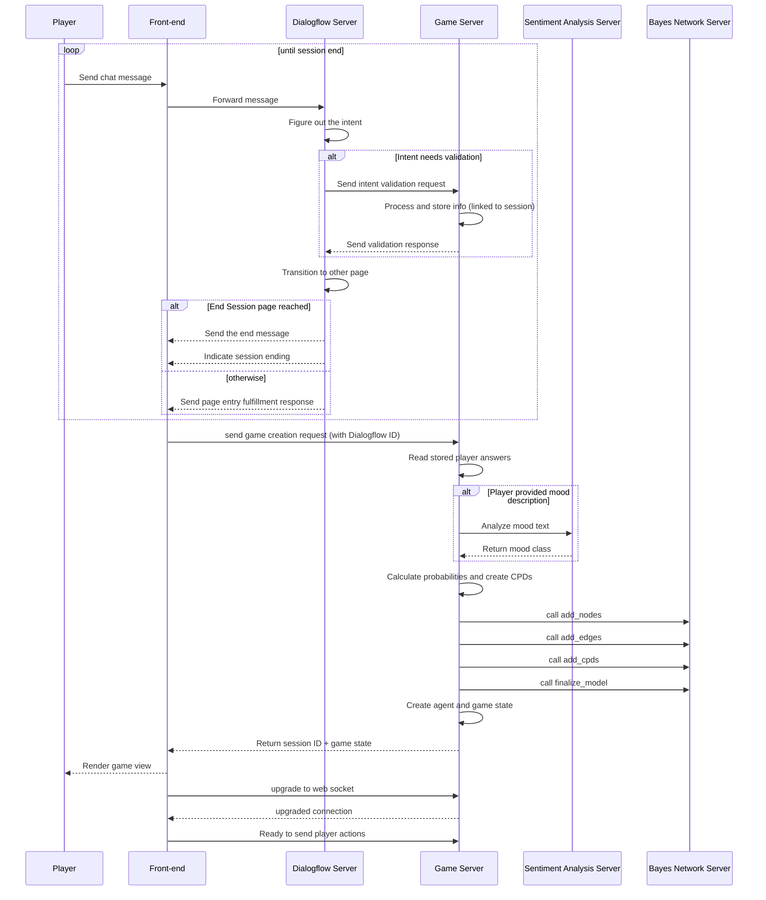

# Deep lore

Delve deeper into the inner workings of a project

## Overview of game initialization sequence:
{: .no_toc }

### What's going on here:
1. User sends chat messages to a conversational agent.
2. Agent extracts intents, validates them through the game servers /info-validation endpoint.
3. Determines which flow page is the next and makes a transition.
4. On transition validated the transition and checks if its the session-end page. In the case that it is:
   - sends page entry fulfillment response.
   - session end signal.
5. Otherwise, only page/flow entry fulfillment response is sent.
6. If session didn't end steps 1-5 are repeated.
7. When session ends, front-end sends game creation request containing Dialogflow ID.
8. The game backend parses the request and looks up stored player answers from the chat.
9. Player's answers about weapon stats or its mood will be used during reasoning, when agent makes action decisions.
10. Another important calculation the server performs is **mood extraction**. The server sends users mood description to a sentiment analyzer to extract its mood class.
11. The mood and speed-damage combo is stored into player answers database.
12. Entries from this database with combination of weapon stache, are then used by the game server to construct a bayes net, which will also be used during reasoning.
13. Once the bayes net is constructed, reasoning game agent gets created.
14. Server then uses newly created agent for creating a session game state.
15. Then the server generates unique session id and sends the game state and the generated id to the front-end.
16. Front-end parses the response, renders game state data and using provided session id establishes a websocket connection with game server.
17. Front-end is ready to send player actions.

## Overview of gameplay and reasoning sequence
{: .no_toc }

### What's going on here:
