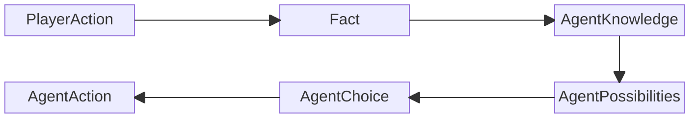
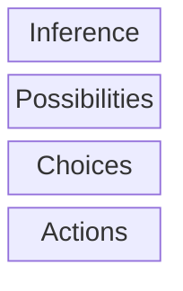
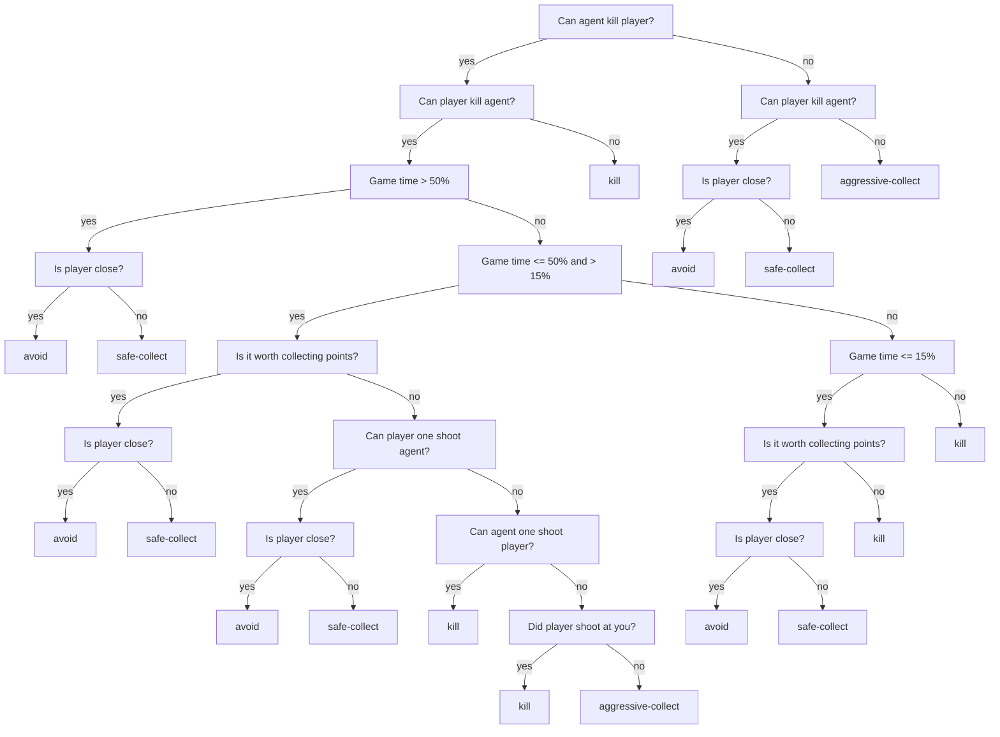

# Agent Reasoning
{: .no_toc }

An overview of how the agent makes decisions.

## Table of contents
{: .no_toc .text-delta }

- TOC
{:toc}

---

## Overview

### Reasoning participants
{: .no-toc}

- **GameState** - a class containing variables which hold information about game environment. Also has methods for validating and applying **PlayerActions** and **AgentActions**, also stores information about **Player** and **Agent** (positions, hp, speed, weapon uses count...)
- **AgentPossibilities** - (add later.)
- **AgentChoice** - (add later.)
- **AgentAction** - interface that defines **apply(GameState) -> void** and **getType() -> ActionType** methods. Concrete implementations of this class have various GameState altering effects that spring into action when **apply** method is called.
- **PlayerAction** - (add later.)
- **Facts** - validated, applied and registered player actions, that happened since the last **agent.reason()** method call.
- **AgentKnowledge** - Agent doesn't have direct access to **GameState**. So this class acts as a collection of gathered truths about the game environment during the course of game and is used in agents decision making.
- **AgentsBrain** - interface which defines a contract for creating various types of agents. Its centerpoint is a **reason** method, which takes in a **GameState** as an argument and applies changes to it.
- **DroolsBrain** - concrete implementation of **AgentsBrain** which uses Drools rule engine and a Bayes net to make gameplay decisions.

### A Journey from player action to agent action
{: .no_toc }



## Reasoning process

The reasoning starts once the **GameUpdateScheduler** updates the game state, 
inserts facts into a facts storage. After that the agent's **reason()** method gets called.

Agents reason method calls Drools brain's reason method. Which looks pretty simple:
```java
    @Override
    public void reason(GameState gameState) {
        knowledge.setPlayerHitBoxKnowledge(gameState.getPlayer().getHitBox(), true);
        
        KieSession kieSession = kieContainer.newKieSession("myKsession");
        kieSession.insert(gameState);                     // GameState object
        kieSession.insert(gameState.getAgent());
        kieSession.insert(knowledge);                     // Current AgentKnowledge
        kieSession.insert(bayesNetwork);                  // BayesNet
        kieSession.insert(marginals);                     // Marginal player stat value probabilities
        kieSession.insert(conditionals);                  // Conditional player stat value probabilities
        kieSession.insert(foundMoods);                    // Moods that were seen in PlayerAnswer database
        kieSession.insert(possibilities);                 // Agent's current possibilities 
        
        // Function callback for getting a list of query variables for a Bayes net query.
        kieSession.insert(new GetQueriesCallable());
        // Function callback for getting a list of evidence variables for a Bayes net query.
        kieSession.insert(new GetEvidenceCallable());
        // Function callback for updating agent's knowledge from a drools rule.
        kieSession.insert(new UpdateKnowledgeCallable());

        try {
            // insert all the player action facts
            gameState.getFacts().forEach(kieSession::insert);
            gameState.clearFacts();
            
            // run inference group rules to update AgentKnowledge
            kieSession.getAgenda().getAgendaGroup("inference-group").setFocus();
            kieSession.fireAllRules();

            // run possibilities group rules to update AgentPossibilities
            kieSession.getAgenda().getAgendaGroup("possibilities-group").setFocus();
            kieSession.fireAllRules();

            // run agent choices group to make an agents strategy choice
            kieSession.getAgenda().getAgendaGroup("agent-choices-group").setFocus();
            kieSession.fireAllRules();
            
            // run agent actions to select best action for currently selected strategy.
            kieSession.getAgenda().getAgendaGroup("agent-actions-group").setFocus();
            kieSession.fireAllRules();

        } finally {
            kieSession.dispose();
        }
    }
```
We essentially insert a bunch of items that will be used by [Drools rules](https://github.com/rchDev/game-of-points/tree/main/game-of-points-be/src/main/resources/drools) into a stateless Drools session which is called **KieSession**.

## Drools Rules

Based on their functional responsibility, rules are divided into four distinct groups:


### [Inference rules](https://github.com/rchDev/game-of-points/blob/main/game-of-points-be/src/main/resources/drools/fact_rules.drl)
{: .no_toc}

These rules fire on inserted facts and update agent knowledge base.

**Example:** a fact about player using their weapon was inserted into kieSession 
and the damage was felt by an agent, a rule: ["Player shot"](https://github.com/rchDev/game-of-points/blob/main/game-of-points-be/src/main/resources/drools/fact_rules.drl) will fire and update [agents' knowledge base](https://github.com/rchDev/game-of-points/blob/main/game-of-points-be/src/main/java/io/rizvan/beans/knowledge/AgentKnowledge.java).

### [Possibilities rules](https://github.com/rchDev/game-of-points/blob/main/game-of-points-be/src/main/resources/drools/possibilities_rules.drl)
{: .no_toc}


### [Agent choices rules](https://github.com/rchDev/game-of-points/blob/main/game-of-points-be/src/main/resources/drools/behavioural_rules.drl) 
{: .no_toc }

Based on agent possibilities that we've inserted by the previous layer rules, 
this group basically implements the decision tree structure seen below and 
produces strategy choice for an agent. Possible strategies include:
1. Avoid player.
2. Collect points - safely (while avoiding player).
3. Collect points - aggressively (while ignoring player).
4. Kill player.



### [Agent Action Rules](https://github.com/rchDev/game-of-points/blob/main/game-of-points-be/src/main/resources/drools/agent_action_rules.drl)
{: .no_toc }

Once the previous layer rules have successfully ran and inserted agent's strategy choice, this layer is ran.

Rules in this layer are responsible for evaluating the current environment and picking the most appropriate action that contributes to current strategy.

For example: **agent chose to kill player**, because the player is really effective at collecting points and there is no way the agent will outpace him. In this case a combination of rules will fire that determine if a player is close enough to be attacked. In the case that it is - **attack**, otherwise - **move** in a direction of a player.
## Bayesian network