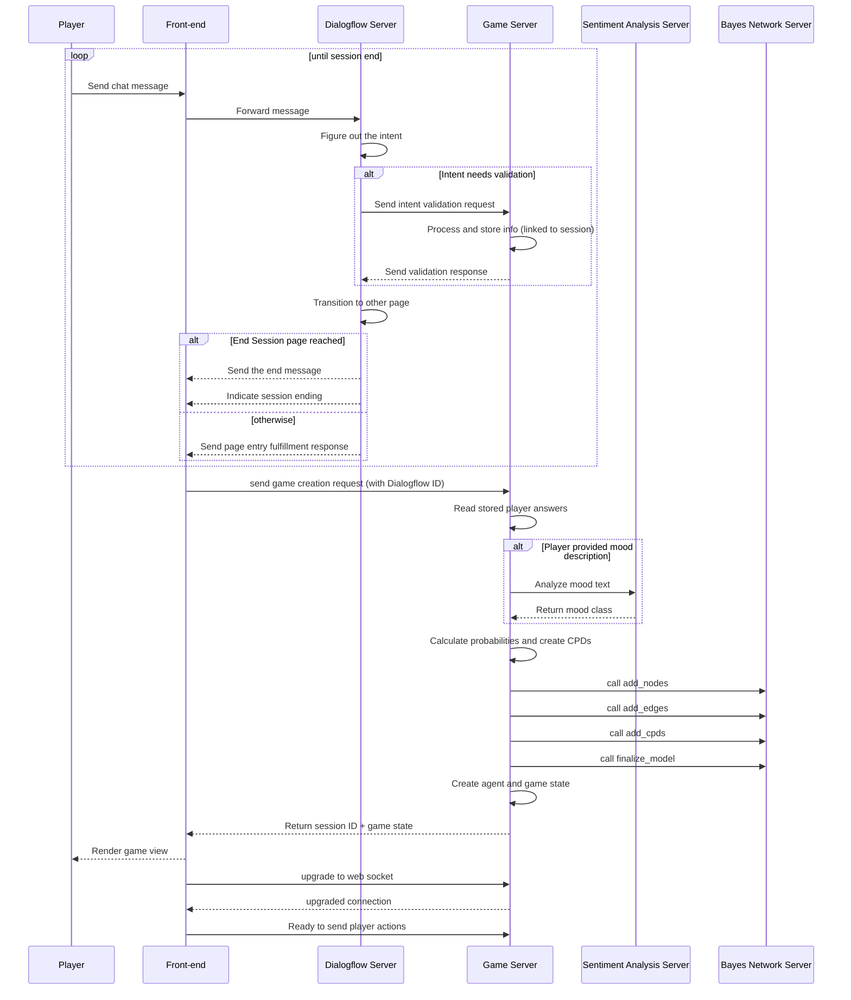

# Deep lore

Delve deeper into the inner workings of a project

## Overview of game initialization sequence:
{: .no_toc }

### What's going on here:
1. The user sends chat messages to a conversational agent. 
2. The agent extracts intents and validates them through the game server's /info-validation endpoint. 
3. It determines which flow page is next and makes a transition. 
4. Upon transition, it validates the transition and checks if it has the session-end page. If it did, it sends:
   - Sends a page entry fulfillment response.
   - Sends a session-end signal.
5. Otherwise, only page/flow entry fulfillment response is sent.
6. If session hasn't ended, steps 1-5 are repeated.
7. When session ends, the front-end sends game creation request containing Dialogflow ID.
8. The game backend parses the request and looks up stored player answers that were collected during the chat.
9. The player's answers about weapon stats or its mood will be used during reasoning, when agent makes action decisions.
10. Another important calculation the server performs is **mood extraction**. The server sends user's mood description to a sentiment classifier service - a trained up neural net - to extract its mood class.
11. The mood and speed-damage combo are then stored in the player answers database.
12. Entries from this database in combination with weapon stache, are then used by the game server to construct a bayes net, which will also be used during reasoning.
13. Once the bayes net is constructed, a reasoning game agent is created.
14. Server then uses newly created agent for creating a session game state.
15. The server generates a unique session id and sends the game state and the generated ID to the front-end.
16. The front-end parses the response, renders the game state, and, using provided session ID, establishes a websocket connection with the game server.
17. Front-end is now ready to send player actions to the game server.

## Overview of gameplay and reasoning sequence
{: .no_toc }

### What's going on here:
