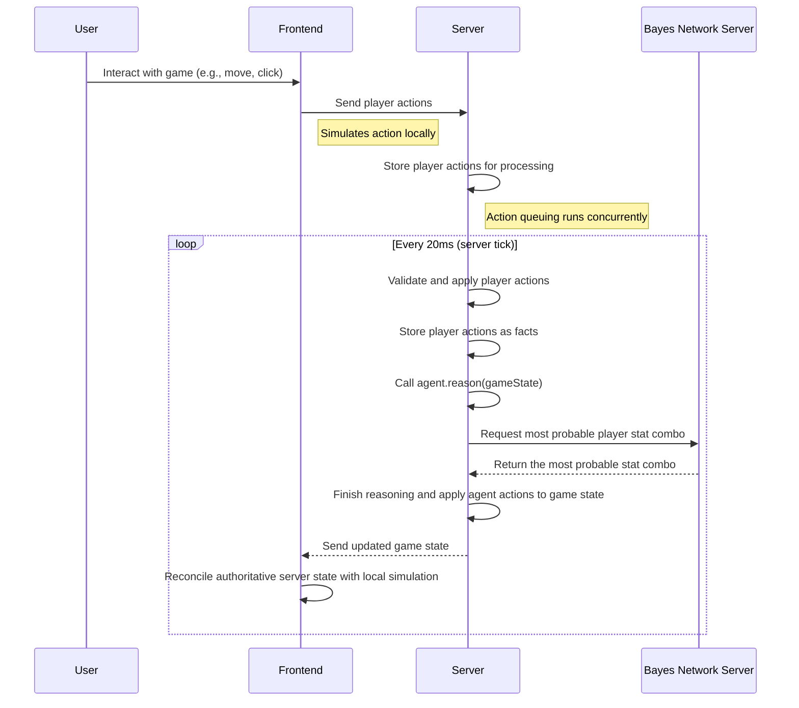

# Deep lore

Delve deeper into the inner workings of a project

## Overview of game initialization sequence:
{: .no_toc }

```mermaid
sequenceDiagram
    participant Player
    participant Frontend
    participant Dialogflow as Dialogflow Server
    participant GameServer as Game Server
    participant Sentiment as Sentiment Analysis Server
    participant Bayes as Bayes Network Server

    %% Chat interaction
    Player ->> Frontend: Send chat message
    Frontend ->> Dialogflow: Forward message
    Dialogflow ->> Dialogflow: Figure out the intent
    alt Intent needs validation
        Dialogflow ->> GameServer: Send intent validation request
        GameServer ->> GameServer: Process and store info (linked to session)
        GameServer -->> Dialogflow: Send validation response
    
    Dialogflow ->> Dialogflow: Transition to other page
    
    %% Chat continues until end page
    alt End Session page reached
        Dialogflow -->> Frontend: Send the end message
        Dialogflow -->> Indicate session ending
    else
        Dialogflow -->> Send page entry fulfillment response
    end
    
    %% Game creation
    Frontend ->> GameServer: send game creation request (with Dialogflow ID)
    GameServer ->> GameServer: Read stored player answers
    alt Player provided mood description
        GameServer ->> Sentiment: Analyze mood text
        Sentiment -->> GameServer: Return mood class
    end
    
    GameServer ->> GameServer: Calculate probabilities and create CPDs

    %% Agent + Bayes Net creation
    GameServer ->> Bayes: call add_nodes
    GameServer ->> Bayes: call add_edges
    GameServer ->> Bayes: call add_cpds
    GameServer ->> Bayes: call finalize_model

    GameServer ->> GameServer: Create agent and game state
    GameServer -->> Frontend: Return session ID + game state
    Frontend ->> Frontend: Render game view

```
### What's going on here:
User types a greeting message into a chat

## Overview of gameplay and reasoning sequence
{: .no_toc }



### What's going on here:
