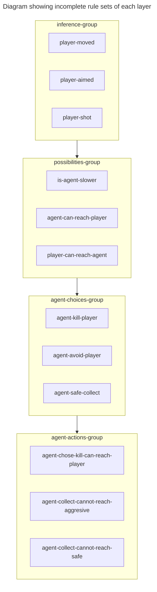
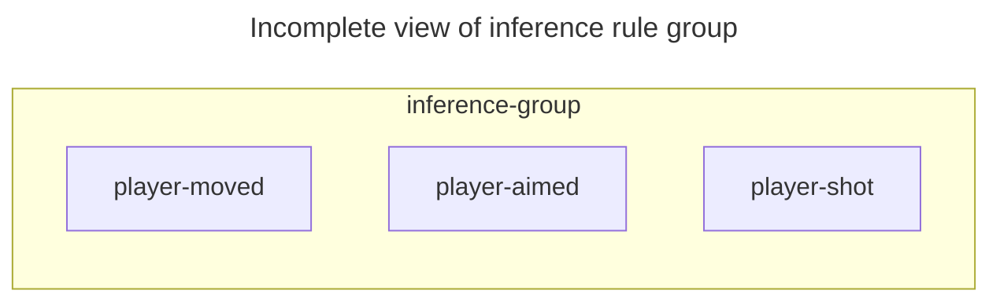
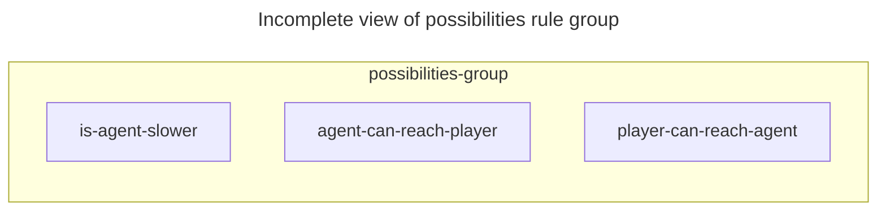
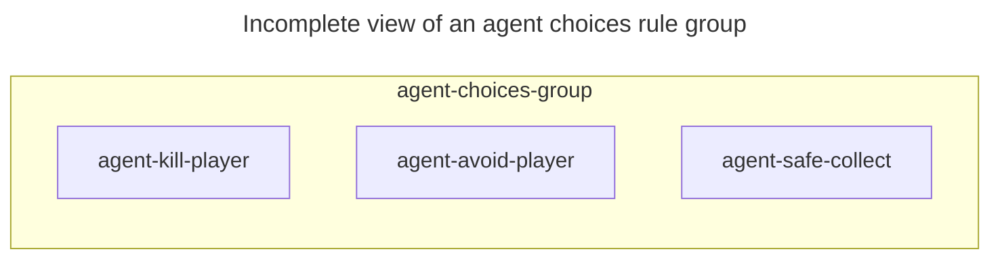
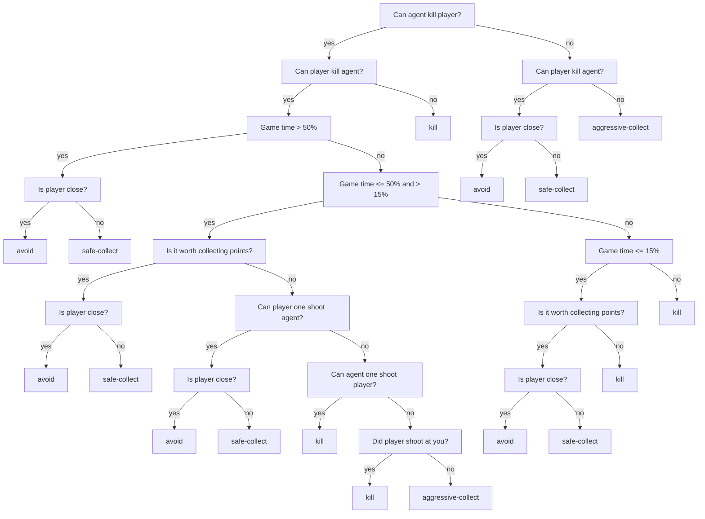
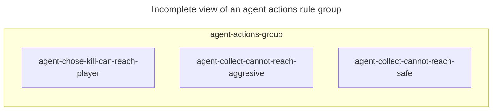

# Drools rules

{: .note }
This solution is prehistoric, when compared with modern AI solutions.
What makes it prehistoric: every decision, strategy and their selection thresholds were designed manually.
It's just an educational step towards understanting how AI systems work.

These rules act as a backbone of reasoning process. By defining Drools rules, you orchestrate the execution of reasoning processes.

In AI field, you ideally want to strive for the E2E solution,
this usually involves using some huge neural net to spit out the final class or vector.
However, this is not always possible. Sometimes the problem state space is too big,
or you don't have enough data, or a huge neural net take too much time to traverse.
In such cases, you may need to manually design the solution or parts of solution yourself.

When designing rules, I took the rule layering approach. Layers act as an agent's action decision construction pipeline.

Layers can be really huge and contain wast amounts of rules generated by other AI systems. They can be presented in a form of trained up DNN or expertly crafted rule sets, or a mixture of both approaches.
By layering rules you can reason about the solution more easily.

**The key idea:** take a huge task and divide it into smaller subtasks, then for each subtask create a layer of rules.
You can choose to create however many layers you need, and however many rules you want. 

In this game, during every time step, agent has to make a decision what action should it take next.
I've designed this action derivation pipeline:
1. Gather facts that occured since the last time step and update AgentKnowledge. (inference-group)
2. Try to fill gaps in the agent's knowledge by using a Bayesian network. (infirence-group)
3. Evaluate the AgentKnowledge and derive agent's capabilities. (possiblities-group)
4. Choose an action strategy. (agent-choices-group)
5. Evaluate the current environment and choose an action that implements or moves the agent towards implementing the current strategy. (agent-actions-group)
6. Apply the action to the game state. (agent-actions-group)

Based on their functional responsibility, rules are divided into four distinct groups:



### [Inference group rules](https://github.com/rchDev/game-of-points/blob/main/game-of-points-be/src/main/resources/drools/fact_rules.drl)



These rules fire on inserted facts and update agent's knowledge base.

**Example:** a fact about the player using its weapon gets inserted into **kieSession**. The damage was felt by an agent as it's HP was subtracted. In this case a rule: ["player-shot"](https://github.com/rchDev/game-of-points/blob/main/game-of-points-be/src/main/resources/drools/fact_rules.drl)
will fire and update [agent's knowledge base](https://github.com/rchDev/game-of-points/blob/main/game-of-points-be/src/main/java/io/rizvan/beans/knowledge/AgentKnowledge.java) with a new damage value.

### [Possibilities group rules](https://github.com/rchDev/game-of-points/blob/main/game-of-points-be/src/main/resources/drools/possibilities_rules.drl)


This layer is responbile for determining the agent's relationship with the player and the rest of environment. Rules in this layer run once the inference group rules have updated the knowledge base.
These rules fire, based on various variable combinations found inside the AgentKnowlege class.

When firing, these rules set boolean variable values inside AgentPossibilities class, see below:
```java
public class AgentPossibilities {
    private boolean canOneShootPlayer;
    private boolean oneShotByPlayer;
    private boolean fasterThanPlayer;
    private boolean slowerThanPlayer;
    private boolean canReachPlayer;
    private boolean reachedByPlayer;

    private boolean canKillPlayer;
    private boolean killedByPlayer;

    private boolean canWinByPointCollection;
    ...
}
```

### [Agent choices group rules](https://github.com/rchDev/game-of-points/blob/main/game-of-points-be/src/main/resources/drools/behavioural_rules.drl)



{: .note }
This layer could have been implemented by using a neural net and passing the parameter vector, derived from the variables found inside the AgentPossibilities class. 
Another possibility was, to use a decision tree, produced by an automatic node splitting function.

This layer is execuced once agent's capabilities have been set by the agent-possibilities layer rules.
Having the knowledge of what agent can and cannot do, rules in this layer are responsible for choosing the best strategy for the current situation.
This group basically implements the decision tree structure seen below and
produces one of these strategy choices:
1. Avoid player.
2. Collect points - safely (while avoiding player).
3. Collect points - aggressively (while ignoring player).
4. Kill player.



### [Agent actions group rules](https://github.com/rchDev/game-of-points/blob/main/game-of-points-be/src/main/resources/drools/agent_action_rules.drl)



Once the previous layer rules have successfully run and inserted agent's strategy choice into a **kieSession**, this layer runs.

Rules in this layer are responsible for evaluating the current environment and picking the most appropriate action that contributes to the currently selected strategy.

**Example:** the previous layer has derived this strategy: **agent-kill-player**, reason being player's effectiveness at collecting points. 
In this case **agent-actions** group will fire a combination of rules, evaluating if a player is within agent's reach,
in the case that it is - **attack** action will be chosen, otherwise - **move** action will be used, to transport agent closer to the player.
