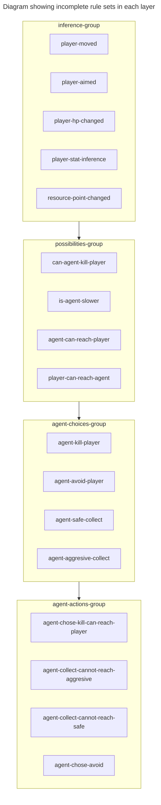
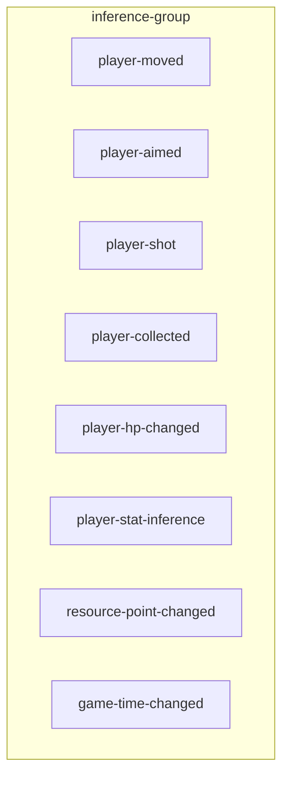
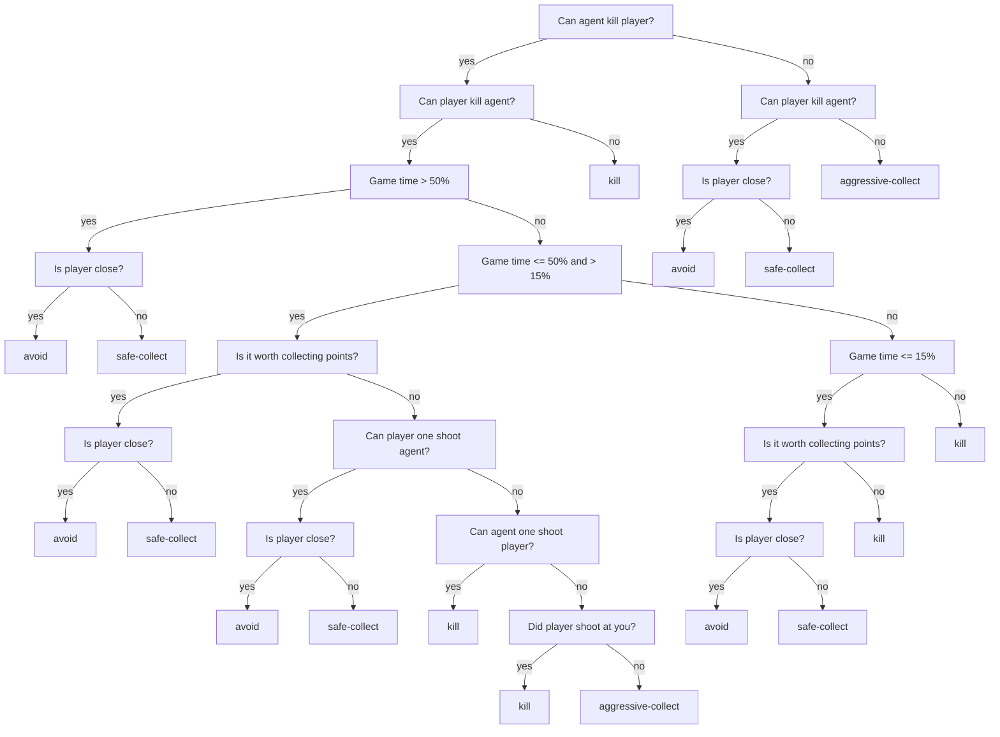

# Drools rules


Based on their functional responsibility, rules are divided into four distinct groups:


### [Inference rules](https://github.com/rchDev/game-of-points/blob/main/game-of-points-be/src/main/resources/drools/fact_rules.drl)



These rules fire on inserted facts and update agent's knowledge base.

**Example:** a fact about player using their weapon was inserted into kieSession
and the damage was felt by an agent, a rule: ["Player shot"](https://github.com/rchDev/game-of-points/blob/main/game-of-points-be/src/main/resources/drools/fact_rules.drl)
will fire and update [agent's knowledge base](https://github.com/rchDev/game-of-points/blob/main/game-of-points-be/src/main/java/io/rizvan/beans/knowledge/AgentKnowledge.java).

### [Possibilities rules](https://github.com/rchDev/game-of-points/blob/main/game-of-points-be/src/main/resources/drools/possibilities_rules.drl)

Once inference rules have updated the knowledge base, possibilities group is ran.
These rules fire, based on variable relationships inside knowledge base and agent classes.

These rules are really simple, they just set variables inside AgentPossibilities class which you can se bellow:
```java
public class AgentPossibilities {
    private boolean canOneShootPlayer;
    private boolean oneShotByPlayer;
    private boolean fasterThanPlayer;
    private boolean slowerThanPlayer;
    private boolean canReachPlayer;
    private boolean reachedByPlayer;

    private boolean canKillPlayer;
    private boolean killedByPlayer;

    private boolean canWinByPointCollection;
    ...
}
```

This class represents agent's relationship with player.

### [Agent choices rules](https://github.com/rchDev/game-of-points/blob/main/game-of-points-be/src/main/resources/drools/behavioural_rules.drl)

Now that we have agent's possibilities, that were inserted by the previous layer rules.
We know what agent can and cannot do. We have to make a strategy choice. That is what this layer is responsible for.
This group basically implements the decision tree structure seen below and
produces strategy choice for an agent. Possible strategies include:
1. Avoid player.
2. Collect points - safely (while avoiding player).
3. Collect points - aggressively (while ignoring player).
4. Kill player.



### [Agent Action Rules](https://github.com/rchDev/game-of-points/blob/main/game-of-points-be/src/main/resources/drools/agent_action_rules.drl)
{: .no_toc }

Once the previous layer rules have successfully run and inserted agent's strategy choice, this layer runs.

Rules in this layer are responsible for evaluating the current environment and picking the most appropriate action that contributes to current strategy.

For example: **agent chose to kill player**,
because the player is really effective at collecting points and
there is no way the agent will outpace him.
In this case a combination of rules will fire that determine if a player is within agents reach,
in that case - **attack**, otherwise - **move** in player's direction.
