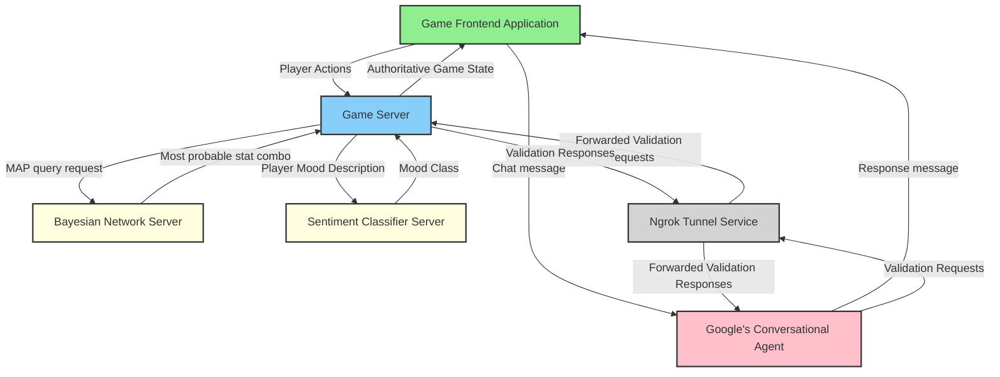

# Game Of Points
{: .no_toc }

A Simple game where human user competes against AI agent in a battle to collect the most points and survive.

{: .note }
*This project was created for educational purposes. Main goal was to explore and play with various technologies: including bayes net, neural net, rule engine libraries, and conversational agent tools.*

## Table of contents
{: .no_toc .text-delta }

- TOC
{:toc}

---

### Game Rules:
{: .no_toc }

1. Game starts with 60s timer, once the time runs out, whoever collected most points - wins. 
2. Points appear at random locations and time intervals. 
3. Both the agent and user start with a random weapon that affects stats like damage, speed, recharge time, and usage count.
4. Whoever kills one another - wins.

## 🌀 Weird parts

This project was created for educational purposes.
It is in no way "production ready". 
There are a bunch of unhandled edge cases, bugs and quirky behaviours as well as creative, but objectively bad problem solutions.

## 📋 Environment setup

❗❗❗ Due to having many small services, the project is hard to launch.
To mitigate this issue, launch scripts have been created.
To use these scripts, you have to install optional dependencies. ❗❗❗

### Required:
{: .no_toc }

**(Step 1) Working Google Conversational Agent (~~Dialogflow CX~~)**
{: .no_toc }

Inside project's root directory you'll find a file: **exported_agent_snitch.blob**

Take this file and import it into your own: <a href="https://conversational-agents.cloud.google.com/projects" target="_blank">Google conversational agent</a> project.

Overview of the process:
1. Create a new project.
2. Create new agent.
3. Restore (import) the agent to use the agent that's inside the repo file.
4. Set the webhook url to your own. 
5. Publish the agent.
6. Use the provided: *project-id*, *agent-id* during npm install.

Detailed instructions can be found: [here](/game-of-points/conv-agent-config/).

**(Step 2) Have git version control installed**

**(Step 3) Install git LFS (Large File Storage)**

Installation instructions can be found here: ["Installing Git Large File Storage"](https://docs.github.com/en/repositories/working-with-files/managing-large-files/installing-git-large-file-storage).

**(Step 4) Make sure *JDK* 17-22 is installed.**
{: .no_toc }

❗Java 23 is not supported and will cause compatibility issues.

**(Step 5) Have Python >=3.12 installed**
{: .no_toc }

1. Install the version that is specified in <a href="https://github.com/rchDev/game-of-points/blob/main/.python-version" target="_blank">.python-version</a> file (use pyenv)
2. Install version that is complies with spec in <a href="https://github.com/rchDev/game-of-points/blob/main/pyproject.toml" target="_blank">pyproject.toml</a> file.

**(Step 6) Install Node.js >=v16.20.2**
{: .no_toc }

### Optional:
{: .no_toc }

**(Step 7) Install Maven 3.2+**
{: .no_toc }

Maven is not required, because Maven will be installed when running one of these commands:
1. ./mvnw shell command on Mac or Linux
2. mvnw.cmd on Windows

**(Step 8) Install IntelliJ IDEA: <a href="https://www.jetbrains.com/idea/download/?section=mac" target="_blank">Mac</a>, <a href="https://www.jetbrains.com/idea/download/?section=linux" target="_blank">Linux</a>, <a href="https://www.jetbrains.com/idea/download/?section=windows" target="_blank">Windows</a>**
{: .no_toc }

Helpful for easily launching the project.

**(Step 9) Install <a href="https://python-poetry.org/docs/#installation" target="_blank">Poetry</a>**
{: .no_toc }

Although not required, but project uses poetry for easy dependency management.
You can use your own virtual environment and install dependencies from <a href="https://github.com/rchDev/game-of-points/blob/main/requirements.txt" target="_blank">requirements.txt</a> file.

**(Step 10) Install <a href="https://ngrok.com/docs/getting-started/" target="_blank">Ngrok</a>**
{: .no_toc }

Used for exposing your local game server to
Google's conversational agents' webhook,
without hosting the game server yourself.

## 🚀 How to launch this project

### Project setup:
{: .no_toc }

**(Step 1): Inside game-of-points project's root directory run:**

```shell
poetry install
``` 

or activate virtual environment of your choice and run:

```shell
pip install -r ./game-of-points-be/requirements.txt
```

**(Step 2): Inside game-of-points/game-of-points-fe, run:**

```shell
npx cross-env PROJECT_ID=<conversational agents project id> AGENT_ID=<conversational agent id> npm install
```

**(Optional) (Step 3): Inside game-of-points/game-of-points-be, run:**

Mac or Linux:

```shell
./mvnw clean install
```

Windows:

```shell
mvnw.cmd clean install
```

**Full setup command to run inside project root:**

Mac or Linux:

```shell
poetry install && \
cd ./game-of-points-fe && \
npx cross-env PROJECT_ID=<conversational_agent_project_id> AGENT_ID=<conversational_agent_id> npm install && \
cd ../game-of-points-be && \
./mvnw clean install
```

Windows:

```shell
poetry install
cd game-of-points-fe
npx cross-env PROJECT_ID=<conversational_agent_project_id> AGENT_ID=<conversational_agent_id> npm install
cd ..\game-of-points-be
mvnw.cmd clean install
```

### **Launching the project**
{: .no_toc }

Once you've set up the project, you can launch it in a few ways by following the steps described below.

**Launching without IntelliJ:**
{: .no_toc }

All these steps should be performed from project's root directory.

***Mac or Linux:***

(Step 1): Run bayes-net:

```shell
cd ./game-of-points-be/src/main/java/io/rizvan/beans/actors/agent && \
poetry run python bayesian_network.py
```

(Step 2): Run sentiment classifier:

```shell
cd ./sentiment-analysis
poetry run python sentiment_classifier.py predict
```

(Step 3): Run game server:

```shell
cd ../../../../../../../../../ && \
./mvnw quarkus:dev
```

(Step 4): Run ngrok:

```shell
ngrok http --domain=<your_public_domain> 8080
```

(Step 5): Run game frontend:

```shell
cd ../game-of-points-fe && \
npm run dev
```

**Windows:**

**Launching with IntelliJ:**
{: .no_toc }

**General launch rules:**
{: .no_toc }

1. Game server depends on working python services (bayes-net and sentiment classifier).
2. Game frontend depends on a working game server
3. The Player data collection step in frontend chat depends on ngrok tunnel (if you are not hosting your backend on public ip address).
   If your conversational agent's webhook isn't pointing to your backend's public address, game server won't receive user questionnaire results.

## 🏗️ System overview

### Main components:
{: .no_toc }

1. Game frontend application.
2. Game server.
3. Bayesian network server.
4. Sentiment classifier server.
5. Google's conversational agent.
6. Ngrok as a tunnel service connecting Google's conversational agent to local game server.



### What is going on:
{: .no_toc }

{: .info }
<a href="https://www.gabrielgambetta.com/client-server-game-architecture.html" target="_blank">*Article that was really helpful while implementing fast-paced multiplayer client-server communication*</a>

{: .info }
More info on [Agent Reasoning](/game-of-points/agent-reasoning/).

1. Game session initialization involving questioning by the conversational agent. 
2. Game frontend sends a bunch of game state updates to game server through a websocket connection (i know... tcp is bad for game dev.)
3. While the game server is processing these updates, frontend app simulates the application of these updates to create an illusion of smooth gameplay experience for a user. 
4. For each game session, game server stores game updates inside a <a href="https://github.com/rchDev/game-of-points/blob/main/game-of-points-be/src/main/java/io/rizvan/beans/SessionStorage.java" target="_blank">session storage</a>. 
5. Once the time for processing comes, server runs the loop through all sessions and starts applying updates for each of game states. See this <a href="https://github.com/rchDev/game-of-points/blob/main/game-of-points-be/src/main/java/io/rizvan/GameStateUpdateScheduler.java" target="_blank">code</a>. 
6. Updating starts with cloning a game state, getting all player actions from the session storage and validating them. 
7. Once actions are deemed valid, they are applied to the game state clone and are registered as **facts** for AI agent. (<a href="https://github.com/rchDev/game-of-points/blob/main/game-of-points-be/src/main/java/io/rizvan/beans/GameState.java">See this place</a>.)
8. Once all facts are registered, [agent.reason](https://github.com/rchDev/game-of-points/blob/main/game-of-points-be/src/main/java/io/rizvan/beans/actors/agent/DroolsBrain.java#L271-L307) method which then uses Drools rule engine and Bayesian network to reason about the current game state, and make action choice decisions based on the current state configuration. 
9. After agent takes these actions, they are applied to the game state clone. 
10. Clone is then placed into game state update history inside session storage.
11. For each session update event is published.
12. [Controller](https://github.com/rchDev/game-of-points/blob/main/game-of-points-be/src/main/java/io/rizvan/StartWebSocket.java#L100-L118) that's listening for those update events, sends updated game states to each session (frontend).
13. Frontend reconciles it's predicted game state with authoritative game state that's provided by backend. ([reconcileWithServerState](https://github.com/rchDev/game-of-points/blob/main/game-of-points-fe/main.js#L341-L354))