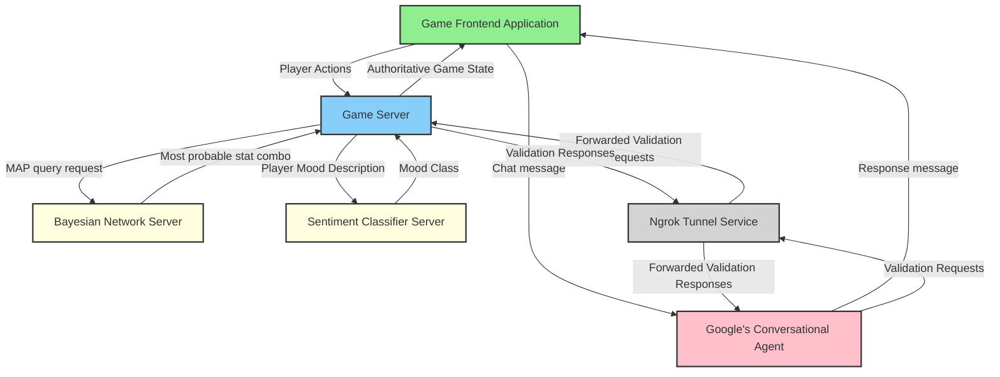

# Game Of Points
{: .no_toc }

A Simple game where human user competes against AI agent in a battle to collect the most points and survive.

{: .note }
*This project was created for educational purposes. Main goal was to explore and play with various technologies: including bayes net, neural net, rule engine libraries, and conversational agent tools.*

## Table of contents
{: .no_toc .text-delta }

- TOC
{:toc}

---

### Game Rules:
{: .no_toc }

1. Game starts with 60s timer, once the time runs out, whoever collected most points - wins. 
2. Points appear at random locations and time intervals. 
3. Both the agent and user start with a random weapon that affects stats like damage, speed, recharge time, and usage count.
4. Whoever kills one another - wins.

## **🌀 Weird parts**

This project was created for educational purposes.
It is in no way "production ready". 
There are a bunch of unhandled edge cases, bugs and quirky behaviours as well as creative, but objectively bad problem solutions.

## **📋 Environment setup**

### Everyone:

**Step 1:** Have Git version control installed.

**Step 2:** Install Git LFS (Large File Storage).

Install and setup instructions can be found here: ["Installing Git Large File Storage"](https://docs.github.com/en/repositories/working-with-files/managing-large-files/installing-git-large-file-storage).

{: .note}
Steps 3 and 4 are optional if you want a working conversational to question a player before the game starts.
The game will work without this step.

**(Optional) Step 3:** Working Google Conversational Agent (~~Dialogflow CX~~)**
{: .no_toc }

1. Inside project's root directory you'll find a file: **exported_agent_snitch.blob**
2. Take this file and import it into your own: [Google conversational agent](https://conversational-agents.cloud.google.com/projects) project.
3. Publish your agent and use provided: *project-id*, *agent-id* in:

```shell
npm run update-bot-ids -- --project-id=<project_id> --agent-id=<agent_id>
```

Sanity check:
```shell
npm run update-bot-ids -- --project-id=<project_id> --agent-id=<agent_id>

# Should print success message similar to this one:
✔ Updated project‑id and agent‑id in index.html
```

**(Optional) Step 4:** Have ngrok installed and configured with your account

Used for exposing your local game server to
Google's conversational agent's webhook,
without hosting the game server yourself.

Sanity check:
```shell
ngrok --version

# Should print version info similar to this: 
ngrok version 3.20.0
```

### ⭐⭐⭐ Docker specific (Recommended) ⭐⭐⭐

**Step 1:** Have docker engine installed and accessible from your terminal

Sanity check:
```shell
docker --version

# Should print version info similar to this: 
Docker version 28.0.4, build b8034c0
```

### ☠️☠️☠️ Non docker setup (Not recommended) ☠️☠️☠️

This takes a lot of hassle to get up and working.

Tested on: macOS 15.4.1, Ubuntu 24.04, Windows WSL2 Ubuntu.

{: .warning}
Won't work on Windows 11 x64. **Reason:** 18 python packages used in a project didn't have wheels for Windows Python versions: 3.8-3.13. I didn't want to play around with versions, so I used Docker.

**Step 1:** Make sure *JDK* 17-22 is installed.

{: .warning}
Java 23 is not supported and will cause compatibility issues. Some maven packages won't build.

Sanity check:
```shell
java --version 

# Should print version info similar to this one:
openjdk 17.0.14 2025-01-21 LTS
OpenJDK Runtime Environment Corretto-17.0.14.7.1 (build 17.0.14+7-LTS)
OpenJDK 64-Bit Server VM Corretto-17.0.14.7.1 (build 17.0.14+7-LTS, mixed mode, sharing)

# and

javac --version

#Should also print version info:
javac 17.0.14
```

**Step 2:** Have Python ==3.12 installed

Best bet is to have the version that is specified in [.python-version](https://github.com/rchDev/game-of-points/blob/main/bayes-net/.python-version) file (use pyenv)

Sanity check:
```shell
python --version

# Should print a python version:
Python 3.12.9
```

**Step 3:** Install Node.js >=v16.20.2

```shell
node --version

# Should print node version that's >= 16.20.2:
v22.14.0
```

**(Optional) Step 4:** Install Maven 3.2+

Maven is not required, because Maven will be installed when running one of these scripts:
1. ./mvnw shell command on Mac or Linux
2. mvnw.cmd on Windows

**(Optional) Step 5:** Install IntelliJ IDEA: [macOS](https://www.jetbrains.com/idea/download/?section=mac), [Linux](https://www.jetbrains.com/idea/download/?section=linux), [Windows](https://www.jetbrains.com/idea/download/?section=windows).

Helpful for launching individual project modules and editing project files.

## **⚙️ Project setup**

### ⭐⭐⭐ Docker specific (Recommended) ⭐⭐⭐

**Step 1:** Inside game-of-points project's root run:

```shell
git lfs pull
```
This will download:
1. The player answers database file.
2. The sentiment analysis ML model.
3. Exported conversational agent file.

---

### ☠️☠️☠️ Non docker (Not Recommended) ☠️☠️☠️

**Step 1:** Inside game-of-points project's root run:
```shell
git lfs pull
```
This will download:
1. The player answers database file.
2. The sentiment analysis ML model.
3. Exported conversational agent file.


**Step 2:** If not already created, create a virtual environment of your choosing, using python version provided in this: [.python-version](https://github.com/rchDev/game-of-points/blob/main/sentiment-classifier/.python-version) file.

**Example with [venv](https://docs.python.org/3/library/venv.html) and [pyenv](https://github.com/pyenv/pyenv):**

Inside projects root run:

```shell
cd ./bayes-net
pyenv local
python -m venv venv/
```
**Step 3:** Activate virtual environment and install dependencies that are specified inside the requirements.txt file.

```shell
source .venv/bin/activate
pip install requirements.txt
```

**Step 4:** While virtual environment is active, launch the bayes net.

```shell
python bayesian_network.py
```

**Step 5:** Change directories to /game-of-points/sentiment-classifier and create another virtual environment there

**Example with [venv](https://docs.python.org/3/library/venv.html) and [pyenv](https://github.com/pyenv/pyenv):**

```shell
cd ../sentiment-classifier
pyenv local
python -m venv venv/
```

**Step 6:** Once again, activate the virtual environment and install dependencies that are specified inside the requirements.txt file, only this this it's inside /game-of-points/sentiment-classifier directory:

```shell
source .venv/bin/activate
pip install requirements.txt
```

```shell
cd ./bayes-net
pip install -r ./game-of-points-be/requirements.txt
```

**(Step 3) Inside game-of-points/game-of-points-fe, run:**

```shell
npx cross-env PROJECT_ID=<conversational agents project id> AGENT_ID=<conversational agent id> npm install
```

**(Optional) (Step 4) Inside game-of-points/game-of-points-be, run:**

Mac or Linux:

```shell
./mvnw clean install
```

Windows:

```shell
mvnw.cmd clean install
```

**Full setup command to run inside project root:**

Mac or Linux:

```shell
poetry install && \
cd ./game-of-points-fe && \
npx cross-env PROJECT_ID=<conversational_agent_project_id> AGENT_ID=<conversational_agent_id> npm install && \
cd ../game-of-points-be && \
./mvnw clean install
```

Windows:

```shell
poetry install
cd game-of-points-fe
npx cross-env PROJECT_ID=<conversational_agent_project_id> AGENT_ID=<conversational_agent_id> npm install
cd ..\game-of-points-be
mvnw.cmd clean install
```

## **🚀 Launching the project**

Once you've set up the environment and the project, you can launch the whole application in a few ways, by following instructions bellow.

**Launching without IntelliJ:**
{: .no_toc }

All these steps should be performed from project's root directory.

***Mac or Linux:***

(Step 1): Run bayes-net:

```shell
cd ./game-of-points-be/src/main/java/io/rizvan/beans/actors/agent && \
poetry run python bayesian_network.py
```

(Step 2): Run sentiment classifier:

```shell
cd ./sentiment-analysis
poetry run python sentiment_classifier.py predict
```

(Step 3): Run game server:

```shell
cd ../../../../../../../../../ && \
./mvnw quarkus:dev
```

(Step 4): Run ngrok:

```shell
ngrok http --domain=<your_public_domain> 8080
```

(Step 5): Run game frontend:

```shell
cd ../game-of-points-fe && \
npm run dev
```

**Windows:**

**Launching with IntelliJ:**
{: .no_toc }

**General launch rules:**
{: .no_toc }

1. Game server depends on working python services (bayes-net and sentiment classifier).
2. Game frontend depends on a working game server
3. The Player data collection step in frontend chat depends on ngrok tunnel (if you are not hosting your backend on public ip address).
   If your conversational agent's webhook isn't pointing to your backend's public address, game server won't receive user questionnaire results.

## **🏗️ System overview**

### Main components:
{: .no_toc }

1. Game frontend application.
2. Game server.
3. Bayesian network server.
4. Sentiment classifier server.
5. Google's conversational agent.
6. Ngrok as a tunnel service connecting Google's conversational agent to local game server.



### What is going on:
{: .no_toc }

{: .info }
<a href="https://www.gabrielgambetta.com/client-server-game-architecture.html" target="_blank">*Article that was really helpful while implementing fast-paced multiplayer client-server communication*</a>

{: .info }
More info on [Agent Reasoning](/game-of-points/agent-reasoning/).

1. Game session initialization involving questioning by the conversational agent. 
2. Game frontend sends a bunch of game state updates to game server through a websocket connection (i know... tcp is bad for game dev.)
3. While the game server is processing these updates, frontend app simulates the application of these updates to create an illusion of smooth gameplay experience for a user. 
4. For each game session, game server stores game updates inside a <a href="https://github.com/rchDev/game-of-points/blob/main/game-of-points-be/src/main/java/io/rizvan/beans/SessionStorage.java" target="_blank">session storage</a>. 
5. Once the time for processing comes, server runs the loop through all sessions and starts applying updates for each of game states. See this <a href="https://github.com/rchDev/game-of-points/blob/main/game-of-points-be/src/main/java/io/rizvan/GameStateUpdateScheduler.java" target="_blank">code</a>. 
6. Updating starts with cloning a game state, getting all player actions from the session storage and validating them. 
7. Once actions are deemed valid, they are applied to the game state clone and are registered as **facts** for AI agent. (<a href="https://github.com/rchDev/game-of-points/blob/main/game-of-points-be/src/main/java/io/rizvan/beans/GameState.java">See this place</a>.)
8. Once all facts are registered, [agent.reason](https://github.com/rchDev/game-of-points/blob/main/game-of-points-be/src/main/java/io/rizvan/beans/actors/agent/DroolsBrain.java#L271-L307) method which then uses Drools rule engine and Bayesian network to reason about the current game state, and make action choice decisions based on the current state configuration. 
9. After agent takes these actions, they are applied to the game state clone. 
10. Clone is then placed into game state update history inside session storage.
11. For each session update event is published.
12. [Controller](https://github.com/rchDev/game-of-points/blob/main/game-of-points-be/src/main/java/io/rizvan/StartWebSocket.java#L100-L118) that's listening for those update events, sends updated game states to each session (frontend).
13. Frontend reconciles it's predicted game state with authoritative game state that's provided by backend. ([reconcileWithServerState](https://github.com/rchDev/game-of-points/blob/main/game-of-points-fe/main.js#L341-L354))