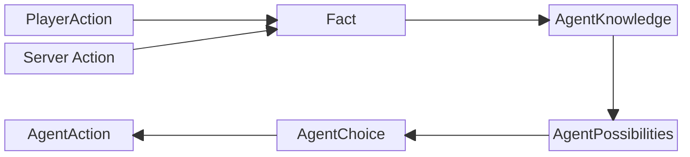

# Reasoning
{: .no_toc }

An overview of agent's decision-making process.

## Table of contents
{: .no_toc .text-delta }

- TOC
{:toc}

---

## Overview

Agent wants to make the best decision for the situation that it is in.

Agent has some knowledge about game environment, but doesn't know anything about player stats.

**Agent knows:**
1. Game time.
2. Point positions.
3. Own stats and point count.
4. Players point count.
5. Existing weapons.

**Agent doesn't know:** player stats (damage, mov. speed, weapon uses, weapon reach).

Agent fills gaps in its information by querying the [**bayes net**](/bayes) for the most probable combination of player stats,
with a set of variables: **query** (unknown) and **evidence** (known).

**Agent gathers information:**
t the start of a match, all variables are unknown (**query**).
As both the player and the agent act in the environment,
the agent gathers information about the player (**evidence**).

**Reasoning** (in the context of this simulation) is the process of finding the most appropriate action to take, given the current **GameState** to achieve **desired outcome**.

**Desired outcome** - winning the game. Which can be achieved by:
1. Collecting the most points until the game time runs out (60s.)
2. Killing the player.

**During the reasoning process:**
1. gathered information from agent's knowledge base: queries, evidence are used to evaluate agent's capabilities (**possibilities**),
2. based on those capabilities, a strategy is chosen (**make a choice**),
3. then, the most appropriate action, that best implements the selected strategy is chosen and applied.

**You can kinda see reasoning process in the server logs:**

```shell
backend-1               | --------------------------
bayesian-1              | INFO:py4j.java_gateway:Received command c on object id t
bayesian-1              | INFO:__main__:query type: <class 'py4j.java_collections.JavaArray'>
bayesian-1              | INFO:__main__:evidence: <class 'py4j.java_collections.JavaArray'>
bayesian-1              | INFO:__main__:evidence: <class 'dict'>
bayesian-1              | INFO:__main__:dict key: damage
bayesian-1              | INFO:__main__:dict key type: <class 'str'>
bayesian-1              | INFO:__main__:dict value: 2
bayesian-1              | INFO:__main__:dict value type: <class 'int'>
Finding Elimination Order: : : 0it [00:00, ?it/s]
0it [00:00, ?it/s]      | 
backend-1               | inference-group: player-stat-inference-ran
bayesian-1              | INFO:__main__:MAP query result: {'speed_mod': 3, 'range': 5, 'uses': 1, 'recharge_time': 0}
backend-1               | agent-choices-group: SAFE-COLLECT
bayesian-1              | INFO:__main__:POST MAP query
backend-1               | agent-action-group: AGENT-CHOSE-COLLECTION: 😨, REACH: ❌
backend-1               | --------------------------
```

### Most important classes in reasoning

- **GameState** - a class containing variables that hold information about the game environment. Also contains methods for validating and applying **PlayerActions** and **AgentActions**, also stores information about resource points, **Player** and **Agent** (positions, hp, speed, weapon uses count...). For each game session new GameState object is created.
- **AgentPossibilities** - a class which contains a bunch of booleans representing various agent capabilities:
```java
public class AgentPossibilities {
    private boolean canOneShootPlayer;
    private boolean oneShotByPlayer;
    private boolean fasterThanPlayer;
    private boolean slowerThanPlayer;
    private boolean canReachPlayer;
    private boolean reachedByPlayer;
    private boolean canKillPlayer;
    private boolean killedByPlayer;
   ...
}
```
- **BayesPythonManager** - an interface that is used on the Java side of py4j relationship. It's used inside PythonGatewayServer's py4j GatewayServers to inform the py4j library about python-side method names, parameter names and types, and return values.  that's responsible for mana
- **PythonGateway** - is a class that manages python gateway servers. Those servers ensure that Java backend is able to communicate with Bayesian network and sentiment classifier. Those services are integral to reasoning process.
- **AgentChoice** - an interfaces that describes a collection of classes that act as an enumeration for possible agent's strategies. Example:
```java
public class AggressiveCollectChoice implements AgentChoice {
   @Override
   public ChoiceType getType() {
      return ChoiceType.AGGRESSIVE_COLLECT;
   }
}
```
- **AgentAction** - an interface that defines a contract for a bunch of classes that represent possible agent actions. It is a way of allowing Agent's brain to modify the GameState in a legal way. Most import method, defined by this interface is **apply(gameState)**. this method takes in a **GameState** and modifies it. The **apply** method contains logic for a particular agent action. Example:
```java
public void apply(GameState gameState) {
    int movementAngle = chooseBestMovementAngle(gameState);
    gameState.applyAction(new AgentMovesAction(movementAngle));
}
```
- **PlayerAction** - an interface that defines a bunch of contract methods to a collection of classes that represent player actions. The most important method is the: **apply(gameState)** method, which takes in a **GameState** object and modifies it. 
Usually the game logic in these player actions is really simple, 
because all decisions and calculations are performed in the player's mind.
Apply method only registers what the user did in the front-end by updating the game state. 
Apply is only called by GameState.applyAction() method, once the action has been validated.
```java
public boolean apply(GameState gameState) {
    gameState.getPlayer().setMouseX(mouseX);
    gameState.getPlayer().setMouseY(mouseY);

    return true;
}
```
- **Facts** - validated, applied and registered player actions, that happened since the last **agent.reason()** method call. They are a method of informing the agenet about important changes in the GameState. Facts are stored in a FactStorage every time a player action or other server action modifies the game state. A few examples below:
```java
// Once the other server action calls addResource method inside a GameState object,
// Fact storage receives a ResourcesChangeFact.
 public void addResource(double x, double y) {
     resources.add(new ResourcePoint(x, y, RESOURCE_SIZE, RESOURCE_SIZE, POINTS_PER_RESOURCE));
     factStorage.add(new ResourcesChangeFact(resources, true));
 }
```
```java
// Every time an action is applied, registerFact is called and player action fact is added to the storage.
 public void applyAction(PlayerAction action) {
     if (!action.isLegal(this)) {
         return;
     }

     var succeeded = action.apply(this);
     if (succeeded) {
         registerAppliedAction(action);
         registerFact(action, true);
     } else if (action instanceof PlayerShootingAction) {
         registerFact(action, false);
     }
 }
```
- **FactStorage** - a class that's responsible for storing GameState facts in server memory. It lives inside a GameState. Every GameState object has its own unique FactStorage object.
- **AgentKnowledge** - agent doesn't have direct access to **GameState**. So this class acts as a collection of gathered truths about the game environment, during the course of game and is used in agent's decision-making. 
It's updated by the inference rule group and used by other rule groups.
- **AgentsBrain** - interface which defines a contract for creating various types of agents. Its centerpoint is a **reason** method, which takes in a **GameState** object as an argument and applies changes to it in a form of **AgentActions**.
- **DroolsBrain** - concrete implementation of **AgentsBrain** which uses Drools rule engine and a Bayes net for deciding which **AgentAction** should be taken.

### A Journey from player action to agent action



## Reasoning process

The reasoning starts once the **GameUpdateScheduler** updates the GameState object.
After that the agent's **reason()** method gets called which, then calls **DroolBrains.reason()** method.

The **reason** method itself is pretty simple:
```java
    @Override
    public void reason(GameState gameState) {
        knowledge.setPlayerHitBoxKnowledge(gameState.getPlayer().getHitBox(), true);
        
        KieSession kieSession = kieContainer.newKieSession("myKsession");
        kieSession.insert(gameState);                     // GameState object
        kieSession.insert(gameState.getAgent());
        kieSession.insert(knowledge);                     // Current AgentKnowledge
        kieSession.insert(bayesNetwork);                  // BayesNet
        kieSession.insert(marginals);                     // Marginal player stat value probabilities
        kieSession.insert(conditionals);                  // Conditional player stat value probabilities
        kieSession.insert(foundMoods);                    // Moods that were seen in PlayerAnswer database
        kieSession.insert(possibilities);                 // Agent's current possibilities 
        
        // Function callback for getting a list of query variables for a Bayes net query.
        kieSession.insert(new GetQueriesCallable());
        // Function callback for getting a list of evidence variables for a Bayes net query.
        kieSession.insert(new GetEvidenceCallable());
        // Function callback for updating agent's knowledge from a drools rule.
        kieSession.insert(new UpdateKnowledgeCallable());

        try {
            // insert all the player action facts
            gameState.getFacts().forEach(kieSession::insert);
            gameState.clearFacts();
            
            // run inference group rules to update AgentKnowledge
            kieSession.getAgenda().getAgendaGroup("inference-group").setFocus();
            kieSession.fireAllRules();

            // run possibilities group rules to update AgentPossibilities
            kieSession.getAgenda().getAgendaGroup("possibilities-group").setFocus();
            kieSession.fireAllRules();

            // run agent choices group to make an agents strategy choice
            kieSession.getAgenda().getAgendaGroup("agent-choices-group").setFocus();
            kieSession.fireAllRules();
            
            // run agent actions to select best action for currently selected strategy.
            kieSession.getAgenda().getAgendaGroup("agent-actions-group").setFocus();
            kieSession.fireAllRules();

        } finally {
            kieSession.dispose();
        }
    }
```
In this method we insert a bunch of items that will be used by [Drools rules](https://github.com/rchDev/game-of-points/tree/main/game-of-points-be/src/main/resources/drools)
into a stateless Drools session which is called **KieSession**.
Then, we run rule groups one after the other. 
This process derives agent's actions, that are then applied to the **GameState**.
