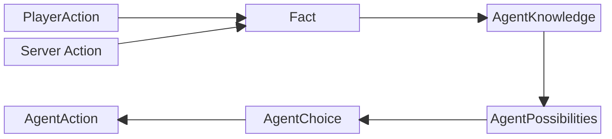
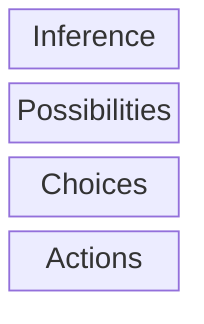
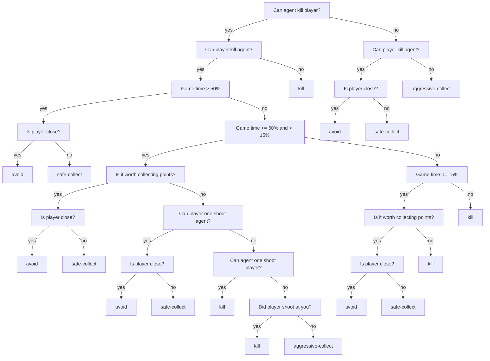
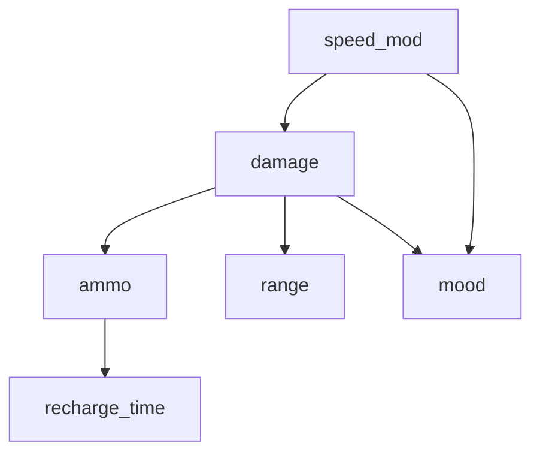
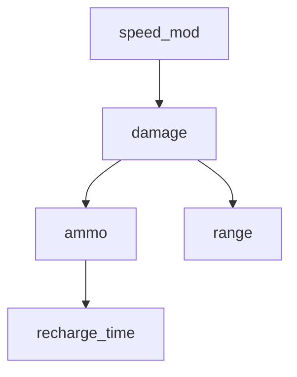

# Agent Reasoning
{: .no_toc }

An overview of agent's decision-making process.

## Table of contents
{: .no_toc .text-delta }

- TOC
{:toc}

---

## Overview

Agent wants to make the best decision for the situation that it is in.

Agent has some knowledge about game environment, but doesn't know anything about player stats.

**Agent knows:**
1. Game time.
2. Point positions.
3. Own stats and point count.
4. Players point count.
5. Existing weapons.

**Agent doesn't know:** player stats (damage, mov. speed, weapon uses, weapon reach).

Agent fills information gaps by querying the [**bayes net**]() for the most probable combination of player stats,
with a set of query (unknown) and a set of evidence (known) variables.

**Agent gathers information:**
at the start of a match, all variables are unknown (**query**).
As both the player and the agent act in the environment,
the agent gathers information about the player (**evidence**).

**Reasoning** (in the context of this simulation) is the process of finding the most appropriate decision to achieve the **desired outcome**.

**Desired outcome** - winning the game. Which can be achieved by:
1. Collecting the most points until the game time runs out (60s.)
2. Killing the player.

**During the reasoning process:**
1. gathered information from agent's knowledge base: queries, evidence are used to evaluate agent's capabilities (**possibilities**).
2. Based on those capabilities a strategy is chosen (**make a choice**).
3. Then, the most appropriate action that best implements the selected strategy is chosen and applied.

**You can kinda see reasoning process in the server logs:**

```shell
backend-1               | --------------------------
bayesian-1              | INFO:py4j.java_gateway:Received command c on object id t
bayesian-1              | INFO:__main__:query type: <class 'py4j.java_collections.JavaArray'>
bayesian-1              | INFO:__main__:evidence: <class 'py4j.java_collections.JavaArray'>
bayesian-1              | INFO:__main__:evidence: <class 'dict'>
bayesian-1              | INFO:__main__:dict key: damage
bayesian-1              | INFO:__main__:dict key type: <class 'str'>
bayesian-1              | INFO:__main__:dict value: 2
bayesian-1              | INFO:__main__:dict value type: <class 'int'>
Finding Elimination Order: : : 0it [00:00, ?it/s]
0it [00:00, ?it/s]      | 
backend-1               | inference-group: player-stat-inference-ran
bayesian-1              | INFO:__main__:MAP query result: {'speed_mod': 3, 'range': 5, 'uses': 1, 'recharge_time': 0}
backend-1               | agent-choices-group: SAFE-COLLECT
bayesian-1              | INFO:__main__:POST MAP query
backend-1               | agent-action-group: AGENT-CHOSE-COLLECTION: 😨, REACH: ❌
backend-1               | --------------------------
```

### Most important classes in reasoning

- **GameState** - a class containing variables which hold information about game environment. Also has methods for validating and applying **PlayerActions** and **AgentActions**, also stores information about **Player** and **Agent** (positions, hp, speed, weapon uses count...)
- **AgentPossibilities** - a class which contains a bunch of booleans representing various agent capabilities.
- **BayesPythonManager** - a class that's responsible for managing py4j gateway servers. Those servers ensure that Java backend is able to communicate with Bayesian network and sentiment classifier. Those services are integral to reasoning process.
- **AgentChoice** - an interfaces that describes a collection of classes that represent agent strategy.
- **AgentAction** - interface that defines a contract for a bunch of classes that represent possible agent actions. It is a way of allowing Agent's brain to modify the GameState in a legal way. Most import method, defined by this interface is **apply(gameState)**. this method takes in a **GameState** and modifies it. The **apply** method contains logic for a particular agent action. Example:
```java
public void apply(GameState gameState) {
    int movementAngle = chooseBestMovementAngle(gameState);
    gameState.applyAction(new AgentMovesAction(movementAngle));
}
```
- **PlayerAction** - interface that defines a bunch of contract methods to a collection of classes that represent player actions. Most important is the **apply(gameState)** method, which takes in a game state and modifies it. 
Usually this the game logic in these player actions is really simple, 
because all decisions and calculations are performed in the player's head.
Apply method only registers what the user did in the front-end by updating the game state. 
Apply is only called by GameState.applyAction() method, once the action has been validated.
```java
public boolean apply(GameState gameState) {
    gameState.getPlayer().setMouseX(mouseX);
    gameState.getPlayer().setMouseY(mouseY);

    return true;
}
```
- **Facts** - validated, applied and registered player actions, that happened since the last **agent.reason()** method call. They are a method of informing the agenet about important changes in the GameState. Facts are stored in a FactStorage every time a player action or other server action modifies the game state. A few examples below:
```java
// Once the other server action calls addResource method inside a GameState object,
// Fact storage receives a ResourcesChangeFact.
 public void addResource(double x, double y) {
     resources.add(new ResourcePoint(x, y, RESOURCE_SIZE, RESOURCE_SIZE, POINTS_PER_RESOURCE));
     factStorage.add(new ResourcesChangeFact(resources, true));
 }
```
```java
// Every time an action is applied, registerFact is called and player action fact is added to the storage.
 public void applyAction(PlayerAction action) {
     if (!action.isLegal(this)) {
         return;
     }

     var succeeded = action.apply(this);
     if (succeeded) {
         registerAppliedAction(action);
         registerFact(action, true);
     } else if (action instanceof PlayerShootingAction) {
         registerFact(action, false);
     }
 }
```
- **FactStorage** - a class that's responsible for storing GameState facts in server memory. It lives inside a GameState. Every GameState object has its own unique FactStorage object.
- **AgentKnowledge** - Agent doesn't have direct access to **GameState**. So this class acts as a collection of gathered truths about the game environment during the course of game and is used in agent's decision-making. It's updated by the inference rule group and used by other rule groups.
- **AgentsBrain** - interface which defines a contract for creating various types of agents. Its centerpoint is a **reason** method, which takes in a **GameState** object as an argument and applies changes to it in a form of **AgentActions**.
- **DroolsBrain** - concrete implementation of **AgentsBrain** which uses Drools rule engine and a Bayes net for deciding which **AgentAction** should be taken.

### A Journey from player action to agent action



## Reasoning process

The reasoning starts once the **GameUpdateScheduler** updates the game state,
inserts facts into a facts storage. After that the agent's **reason()** method gets called.

Agents reason method calls Drools brain's reason method. Which looks pretty simple:
```java
    @Override
    public void reason(GameState gameState) {
        knowledge.setPlayerHitBoxKnowledge(gameState.getPlayer().getHitBox(), true);
        
        KieSession kieSession = kieContainer.newKieSession("myKsession");
        kieSession.insert(gameState);                     // GameState object
        kieSession.insert(gameState.getAgent());
        kieSession.insert(knowledge);                     // Current AgentKnowledge
        kieSession.insert(bayesNetwork);                  // BayesNet
        kieSession.insert(marginals);                     // Marginal player stat value probabilities
        kieSession.insert(conditionals);                  // Conditional player stat value probabilities
        kieSession.insert(foundMoods);                    // Moods that were seen in PlayerAnswer database
        kieSession.insert(possibilities);                 // Agent's current possibilities 
        
        // Function callback for getting a list of query variables for a Bayes net query.
        kieSession.insert(new GetQueriesCallable());
        // Function callback for getting a list of evidence variables for a Bayes net query.
        kieSession.insert(new GetEvidenceCallable());
        // Function callback for updating agent's knowledge from a drools rule.
        kieSession.insert(new UpdateKnowledgeCallable());

        try {
            // insert all the player action facts
            gameState.getFacts().forEach(kieSession::insert);
            gameState.clearFacts();
            
            // run inference group rules to update AgentKnowledge
            kieSession.getAgenda().getAgendaGroup("inference-group").setFocus();
            kieSession.fireAllRules();

            // run possibilities group rules to update AgentPossibilities
            kieSession.getAgenda().getAgendaGroup("possibilities-group").setFocus();
            kieSession.fireAllRules();

            // run agent choices group to make an agents strategy choice
            kieSession.getAgenda().getAgendaGroup("agent-choices-group").setFocus();
            kieSession.fireAllRules();
            
            // run agent actions to select best action for currently selected strategy.
            kieSession.getAgenda().getAgendaGroup("agent-actions-group").setFocus();
            kieSession.fireAllRules();

        } finally {
            kieSession.dispose();
        }
    }
```
In this method we essentially insert a bunch of items that will be used by
[Drools rules](https://github.com/rchDev/game-of-points/tree/main/game-of-points-be/src/main/resources/drools)
into a stateless Drools session which is called **KieSession**.
Then we run rule groups one after the other. This process modifies **GameState**.

## Drools Rules

Based on their functional responsibility, rules are divided into four distinct groups:


### [Inference rules](https://github.com/rchDev/game-of-points/blob/main/game-of-points-be/src/main/resources/drools/fact_rules.drl)

These rules fire on inserted facts and update agent's knowledge base.

**Example:** a fact about player using their weapon was inserted into kieSession
and the damage was felt by an agent, a rule: ["Player shot"](https://github.com/rchDev/game-of-points/blob/main/game-of-points-be/src/main/resources/drools/fact_rules.drl)
will fire and update [agent's knowledge base](https://github.com/rchDev/game-of-points/blob/main/game-of-points-be/src/main/java/io/rizvan/beans/knowledge/AgentKnowledge.java).

### [Possibilities rules](https://github.com/rchDev/game-of-points/blob/main/game-of-points-be/src/main/resources/drools/possibilities_rules.drl)

Once inference rules have updated the knowledge base, possibilities group is ran.
These rules fire, based on variable relationships inside knowledge base and agent classes.

These rules are really simple, they just set variables inside AgentPossibilities class which you can se bellow:
```java
public class AgentPossibilities {
    private boolean canOneShootPlayer;
    private boolean oneShotByPlayer;
    private boolean fasterThanPlayer;
    private boolean slowerThanPlayer;
    private boolean canReachPlayer;
    private boolean reachedByPlayer;

    private boolean canKillPlayer;
    private boolean killedByPlayer;

    private boolean canWinByPointCollection;
    ...
}
```

This class represents agent's relationship with player.

### [Agent choices rules](https://github.com/rchDev/game-of-points/blob/main/game-of-points-be/src/main/resources/drools/behavioural_rules.drl)

Now that we have agent's possibilities, that were inserted by the previous layer rules.
We know what agent can and cannot do. We have to make a strategy choice. That is what this layer is responsible for.
This group basically implements the decision tree structure seen below and
produces strategy choice for an agent. Possible strategies include:
1. Avoid player.
2. Collect points - safely (while avoiding player).
3. Collect points - aggressively (while ignoring player).
4. Kill player.



### [Agent Action Rules](https://github.com/rchDev/game-of-points/blob/main/game-of-points-be/src/main/resources/drools/agent_action_rules.drl)
{: .no_toc }

Once the previous layer rules have successfully run and inserted agent's strategy choice, this layer runs.

Rules in this layer are responsible for evaluating the current environment and picking the most appropriate action that contributes to current strategy.

For example: **agent chose to kill player**,
because the player is really effective at collecting points and
there is no way the agent will outpace him.
In this case a combination of rules will fire that determine if a player is within agents reach,
in that case - **attack**, otherwise - **move** in player's direction.

## [Bayesian network](https://github.com/rchDev/game-of-points/blob/main/game-of-points-be/src/main/java/io/rizvan/beans/actors/agent/bayesian_network.py)

Drools rule engine gains information about player's stats from facts.
Not all info can be known right away, at the start of a game.
Most of the time, rules engine only has partial information about player stats,
while agent's capability assessment process heavily depends on having complete information.
The Solution to this partial information problem is **Bayesian network**.

Known stats are presented as **evidence** and unknown are given as **query** variables.

### Main use:

The main use for Bayes net in my app is to: **get the most probable combination of random variables.**

### Used libraries:

[pgmpy (Probabilistic Graphical Models using Python)](https://pgmpy.org/) - Python library designed for working with probabilistic graphical models (PGMs) such as Bayesian Networks and Markov Networks.

[py4j (A Bridge between Python and Java)](https://www.py4j.org/) - Py4J enables Python programs running in a Python interpreter to dynamically access Java objects in a Java Virtual Machine.

**pgmpy** was used for creating the actual bayes network in python: [here](https://github.com/rchDev/game-of-points/blob/main/game-of-points-be/src/main/java/io/rizvan/beans/actors/agent/bayesian_network.py),
but the game server, where this bayes net will be used, is written in Java. So i used **py4j** to translate
and the exchange JVM objects with Python interpreter.

For **py4j** to work, it needs a Gateway server on Python side, that runs on some port and listens on another,
then on Java side you instantiate a Gateway server which at the point of calling:

```java
bayesGatewayServer.getPythonServerEntryPoint(
        new Class[]{ BayesPythonManager.class }
);
```

creates a connection between two servers.

{: .note }
The Python-side server must be running before the Java-side server, as the Java side initiates the connection. Since this class is instantiated during server startup, the Python servers must be up before the Java game server starts.

```java
...

@Singleton
@Startup
public class PythonGateway {
    private GatewayServer bayesGatewayServer;
    private GatewayServer sentimentGatewayServer;
    private BayesPythonManager bayesManager;
    private SentimentPythonManager sentimentPythonManager;

    @PostConstruct
    public void init() {

        bayesGatewayServer = new GatewayServer(
                null,                    // entryPoint
                25333,                   // port
                25334,                   // pythonPort
                GatewayServer.defaultAddress(),  // address
                GatewayServer.defaultAddress(),  // pythonAddress
                GatewayServer.DEFAULT_CONNECT_TIMEOUT,  // connectTimeout
                GatewayServer.DEFAULT_READ_TIMEOUT,     // readTimeout
                null                      // customCommands
        );
        bayesGatewayServer.start();

        // Initialize the Sentiment Gateway Server with its own Python and callback ports
        sentimentGatewayServer = new GatewayServer(
                null,
                25335,
                25336,
                GatewayServer.defaultAddress(),  // address
                GatewayServer.defaultAddress(),  // pythonAddress
                GatewayServer.DEFAULT_CONNECT_TIMEOUT,  // connectTimeout
                GatewayServer.DEFAULT_READ_TIMEOUT,
                null
        );
        sentimentGatewayServer.start();

        bayesManager = (BayesPythonManager) bayesGatewayServer.getPythonServerEntryPoint(new Class[]{BayesPythonManager.class});
        sentimentPythonManager = (SentimentPythonManager) sentimentGatewayServer.getPythonServerEntryPoint(new Class[]{SentimentPythonManager.class});
    }

    public BayesPythonManager getBayesNetwork() {
        return bayesManager;
    }

    public SentimentPythonManager getSentimentAnalyser() {
        return sentimentPythonManager;
    }
}
```

**What is BayesPythonManager?**
It's an interface that defines a contract which Python side has to implement. It is probably used to inform **py4j's** serializers and mappers.
You pass it to a gateway server and get an object which contains all those methods that you can then use to call the actual Bayes-net on the Python side.
```java
...
public interface BayesPythonManager {
    void add_nodes(List<String> nodes);

    void add_edges(List<String[]> edges);

    void add_cpd(String variable, int variable_card, double[][] values, String[] evidence, int[] evidence_card);

    void finalize_model();

    Map<String, Integer> map_query(String[] query, String[][] evidence);
}
```

### Construction:

Now that we have Python objects available to us, we can use methods:
1. add_nodes
2. add_edges
3. add_cpd
4. finalize_model

to construct the Bayes-net.


Bayesian network gets created inside DroolsBrain class,
during agent's creation, when a game session gets initialized.

Network is created by using weapon cache data and player answers database, which consists of weapon-mood combinations.

There are two version of a network: one with mood node and one without it.
Which version get created depends on multiple factors, such as:
1. Did we receive player mood answer from the conversational agent session during the session initialization phase:
    - yes - check the other condition,
    - no - create bayes net without mood variable.
2. Does the player answers database contain all possible damage and speed values.
   Mood variable depends on speed and damage variables,
   so you cannot connect mood with speed and damage if some of the values are missing,
   unless you create a truncated speed/damage variable.
    - yes - create with mood variable.
    - no - create without mood variable.

**Construction process:**

1. Go through the whole weapon list, **count** how many times each value of every weapon stat showed up.
2. Divide stat counts by the total weapon count to get the **marginal probability** of that stat showing up.
3. If the stat is fully independent, we already have all the info we need.
4. Otherwise, when weapon stat is only conditionally independent while knowing some other stat, we count how many times did the query-evidence combo occur and divide the count by the total number of weapons. This way we get joint probability: P(query, evidence). To get P(query | evidence), we divide joint probability by marginal probability of evidence: P(evidence).
   At the end of this we get conditional probability distribution table in a form of matrix, that we could then feed into **add_cpd** function.

{: .note}
There's a bunch of additional stuff going on this function. Most of it is just convenience metadata.
In an instance when we can add mood variable

```java
    private ConditionalResult getConditionalProbabilities(
        List<Weapon> weapons,
        MarginalResult marginalResult,
        List<Pair<Weapon.Stat, Weapon.Stat>> conditionalRelations
) {
        // evidence -> query -> cpd for evidence-query     
        HashMap<Weapon.Stat, HashMap<Weapon.Stat, double[][]>> statCPDs = new HashMap<>();
        
        // query and evidence values stored separately for convenient access later
        HashMap<Weapon.Stat, List<Number>> statQueryValues = new HashMap<>();
        HashMap<Weapon.Stat, List<Number>> statEvidenceValues = new HashMap<>();

        for (var relation : conditionalRelations) {
            var queryStat = relation.getFirst();
            var evidenceStat = relation.getSecond();

            var queryValues = marginalResult.values.get(queryStat);
            var evidenceValues = marginalResult.values.get(evidenceStat);

            // Init conditional probability distribution table from query-evidence pair
            double[][] cpd = new double[queryValues.size()][evidenceValues.size()];
            for (int i = 0; i < queryValues.size(); i++) {
                for (int j = 0; j < evidenceValues.size(); j++) {
                    cpd[i][j] = 0.0;
                }
            }

            // Count how many times each query-evidence combo occur
            for (var weapon : weapons) {
                int queryIndex = queryValues.indexOf(weapon.getStat(queryStat));
                int evidenceIndex = evidenceValues.indexOf(weapon.getStat(evidenceStat));

                cpd[queryIndex][evidenceIndex]++;
            }

            // Calculate conditional prob P(query|evidence) by:
            // 1. computing joint probability P(query,evidence) by dividing query-evidence occurrences by total weapon count
            // 2. dividing joint probability by the marginal probability of P(evidence) to get P(query|evidence)
           for (int i = 0; i < queryValues.size(); i++) {
                for (int j = 0; j < evidenceValues.size(); j++) {
                    var evidenceProb = marginalResult.probabilities.get(evidenceStat).get(j);
                    cpd[i][j] /= weapons.size();
                    cpd[i][j] /= evidenceProb;
                }
            }

           var statCPDValues = new HashMap<Weapon.Stat, double[][]>();
           statCPDValues.put(evidenceStat, cpd);
           statCPDs.put(queryStat, statCPDValues);
           statQueryValues.put(queryStat, queryValues);
           statEvidenceValues.put(evidenceStat, evidenceValues);
        }
        
        return new ConditionalResult(statQueryValues, statEvidenceValues, statCPDs);
    }
```

5. We add all nodes to the network by calling bayesNetwork.add_nodes() and passing it nodes list.
6. We connect all the nodes by calling bayesNetwork.add_edges() and pass a list of string lists of each containing a related nodes.
7. We call [**addMoodNode**](https://github.com/rchDev/game-of-points/blob/main/game-of-points-be/src/main/java/io/rizvan/beans/actors/agent/DroolsBrain.java#L107-L199) method, which conditionally adds mood node if all weapon: speed and damage values have shown up at least once.

### Versions:
{: .no_toc}

**Version 1 (with mood)**



**Version 2 (without mood)**

