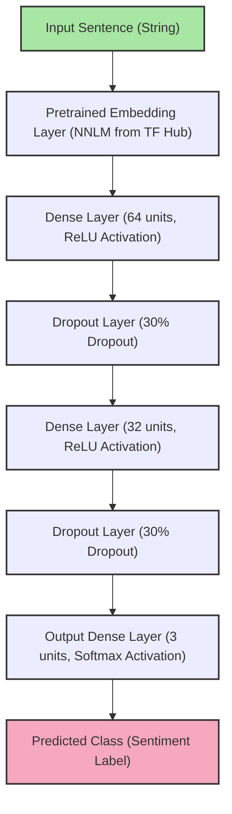

# Sentiment Analysis

The point of sentiment analysis in my application is to take a mood description and assign it one of three classes:
1. Optimistic
2. Neutral
3. Pessimistic

## The model

{: .note }
I'm not a ML expert, I don't have the critical information needed to evaluate the quality of this solution.
I just copied things from the internet until it worked.

I essentially used a transfer learning technique:
1. Took a huge neural net, froze it (don't have enough data to train in).
2. Tacked on a bunch of densely connected layers, that I could train with my measly data set.
3. Added the output layer that matched my multiclass classification problem.

### Layers

<div style="text-align: center;">

</div>


**Layer 0:** Pretrained embeddings layer. A smaller BERT alternative for getting contextual embeddings.

{: .warning }
This layer is locked for training, because I didn't have enough data to train that huge neural net.

{: .note }
Contextual means that you get different vector for each word based on the context that that word appears in.
With traditional methods like: "Word2Vec" or "GloVe" you would get a fixed value vector for each word.
In the famous bank example, when using traditional embeddings, the word bank would have same meaning in both of the sentences:
"The bank of the river was flooded." and "I went to the bank to deposit money."

**Layer 1:** The word vectors are first passed to a densely connected layer with 64 neurons, a ReLU activation function and an L2 regularizer, which penalizes large weight values.

**Layer 2:** The output of the previous dense layer is then passed to a dropout layer, which randomly drops 30% of neurons during training (no effect during prediction) to help prevent overfitting — another regularization technique.

**Layer 3:** Another dense layer with 32 neurons, ReLU activation and L2 regularization.

**Layer 4:** Another 30% dropout layer to fight overfitting.

**Layer 5:** Output layer, which is a densely connected layer with a softmax function activation function, that outputs three probabilities, one for each class.

### Meta params:

**Optimization target (loss function)** - Categorical crossentropy (don't know why, ChatGPT said it was good for multiclass classification problems)

**Optimizer** - Adam (no clue why not RMSprop or some other optimizer. It just works...)

**Learning rate** - 0.001 (don't know what is a good learning rate or how it should change during the training process)

### [Full Code](https://github.com/rchDev/game-of-points/blob/main/game-of-points-be/src/main/java/io/rizvan/beans/actors/agent/sentiment-analysis/sentiment_classifier.py#L20-L36)
```python
 def __init__(self):
     # Load the pre-trained model and build the classifier
     hub_url = "https://tfhub.dev/google/nnlm-en-dim50/2" # alternative to bert
     self.pretrained_embedding_layer = hub.KerasLayer(hub_url, input_shape=[], dtype=tf.string, trainable=False)

     self.model = tf_keras.Sequential([
         hub.KerasLayer(hub_url, input_shape=[], dtype=tf.string, trainable=True),
         tf_keras.layers.Dense(64, activation='relu', kernel_regularizer=tf_keras.regularizers.l2(0.01)),
         tf_keras.layers.Dropout(0.3),
         tf_keras.layers.Dense(32, activation='relu', kernel_regularizer=tf_keras.regularizers.l2(0.01)),
         tf_keras.layers.Dropout(0.3),
         tf_keras.layers.Dense(3, activation='softmax')  # three output nodes for three classes
     ])

     self.model.compile(optimizer=tf_keras.optimizers.Adam(learning_rate=0.001),
                        loss='categorical_crossentropy', metrics=['accuracy'])
     logger.info("SentimentAnalysisModel initialized.")
```

## [sentiment_classifier.py](https://github.com/rchDev/game-of-points/blob/main/game-of-points-be/src/main/java/io/rizvan/beans/actors/agent/sentiment-analysis/sentiment_classifier.py)

The solution is written in python, but is used in Java project. 
This is enabled by the [py4j](https://www.py4j.org/) library. 
More info can be found in a write-up about [Agent's reasoning process](/game-of-points/agent-reasoning), 
in a Bayesian networks "Used libraries" section.

The script can be launched in three modes: training, testing or prediction mode.

```python
    if args.mode == 'train':
        if args.csv:
            train_mode(args.csv)
        else:
            logger.error("CSV file path must be provided for training mode.")
    elif args.mode == 'test':
        if args.sentence:
            print(f"sentence: {args.sentence}")
            model = SentimentAnalysisModel()
            model.load_model("sentiment_model.keras")
            prediction = model.predict_sentiment([args.sentence])
            print(f"prediction: {prediction}")
            print(f"The sentiment is: {prediction[0]}")
        else:
            logger.error("Sentence must be provided for test mode.")
    else:
        prediction_mode()
```

## Training mode

### Command

{: .note}
Only csv parsing was implemented...

In project's root run:

```shell
cd game-of-points-be/src/main/java/io/rizvan/beans/actors/agent/sentiment-analysis
poetry run python sentiment_classifier.py train --csv <data_file_name.csv>
```

### **Data**
There are many pretrained emotion/sentiment classifiers, but since I had to build my own. 
The first and the hardest problem I had to tacle was: **acquiring labeled data**.

At first, I naively tried to use popular LLMs on the internet to generate unique player answers and their class labels, 
to a proposed question: "how are feeling before this upcoming match?"
As I recall, I've tried ChatGPT 4o, some version of Claude and Gemini.

At the time of creating this model, at around Aug. 2024, none of these LLMs could generate unique data. 
For example in a list of 100 answers only 15-30 answers would be unique, the rest would be duplicates with different labels.
And no matter how elaborate my prompting attempts were, I couldn't get even 100 unique answers with correct labels.

I still tried to use that data in training, but as my intuition was telling me, the data was completely **useless:**
1. **unbalanced** - too many labels of one class (e.g. optimistic),
2. **lots of duplicates** - same exact answer showing up many times,
3. **not diverse** - comes from a single source (my mind, some probably from LLM),
4. **no noise** - sentences were perfect: no typos, no grammatical errors, no slang terms, correct punctuation,
5. **inconsistent labels** - duplicated values having different labels.

**The result of using this data:** incredible training and test accuracy >0.98, but terrible real world results.
The trained model couldn't even classify the simplest answers, like: "I'm feeling great."

Then i decided to use some of the uniquely generated answers, label them myself and my own answer.
This resulted in a dataset that contained roughly 100 mood description-label pairs.
Now the set had:
1. Consistent labels.
2. Some noise.

**Result:** satisfactory real-world performance when mood is described by myself.
Simple responses like: "OK," "Good," "I'm feeling great," and "I'm scared" are classified correctly.

### The process of training

First the function [train_mode(csv_file, epochs=15, batch_size=32)](https://github.com/rchDev/game-of-points/blob/main/game-of-points-be/src/main/java/io/rizvan/beans/actors/agent/sentiment-analysis/sentiment_classifier.py#L137-L170) gets called where:
1. CSV file is read into a pandas DataFrame.
2. Then a map for mapping sentiment names to array labels get created.
3. Labels in pandas DataFrame get converted to array indexes.
4. We extract sentences and their labels into separate numpy ndArrays.
5. We pass the extracted sentences and their labels into a helper function from sklearn library called: train_test_split and get four numpy arrays:
   - training sentences - x_train (80%),
   - training labels - y_train (80%),
   - test sentences - x_test (20%),
   - test labels - y_test (20%).
6. Once data prep is done, we initialize SentimentAnalysisModel and save it into a variable called **model**.
7. When the model is initialized, train_model(self, sentences, labels, epochs=15, batch_size=32) method gets called.
8. Once the model is fully fitted, we test its performance on data that it has never seen, by calling a method called evaluate_model(x_test, y_test) with a test data and labels.
9. Finally, we log test results to the standard output and save the model parameters to a local .keras type file.

```python
def train_mode(csv_file, epochs=15, batch_size=32):
    # Read CSV file
    logger.info(f"Reading training data from {csv_file}")
    data = pd.read_csv(csv_file)

    # Map sentiment labels to numerical values
    sentiment_mapping = {
        "Pessimistic": 0,
        "Neutral": 1,
        "Optimistic": 2
    }

    # Map sentiment labels to corresponding numerical values
    data['label'] = data['Sentiment'].map(sentiment_mapping)

    # Extract sentences and labels
    sentences = data['Sentence'].values
    labels = data['label'].values

    # Split data into training and test sets
    X_train, X_test, y_train, y_test = train_test_split(sentences, labels, test_size=0.2, random_state=42)

    # Initialize model
    model = SentimentAnalysisModel()

    # Train the model
    model.train_model(X_train, y_train, epochs, batch_size)

    # Evaluate the model
    evaluation_result = model.evaluate_model(X_test, y_test)
    logger.info(f"Evaluation result: {evaluation_result}")

    # Save the model
    model.save_model("./sentiment_model.keras")
```

Inside the **train_model** method:
1. Labels inside a numpy array get converted into one-hot encodings to fit loss function's: categorical_crossentropy, 
and last layer activation function's: softmax requirements.
2. A function callback for early stoppage during the training is defined. 
Early stoppage should happen if loss function values when testing model with a validation set,
don't get smaller for more than three epochs. If they don't - stop the training and use weights that produced the best result.
3. Keras fit() method gets called and passed all the params that it needs, then it "trains" the model by computing the loss,
calculating gradients via backpropagation, and updating parameters using an optimizer (in this case Adam) with multiple mini-batches of data 
and over multiple epochs.

```python
def train_model(self, sentences, labels, epochs=15, batch_size=32):
    try:
        # Convert labels to one-hot encoding: [1, 0, 0], [0, 1, 0], [0, 0, 1]
        labels = tf_keras.utils.to_categorical(labels, num_classes=3)

        # Define early stopping function callback
        early_stopping = tf_keras.callbacks.EarlyStopping(
            monitor='val_loss', # monitor validation loss
            patience=3, # stop when validation loss doesn't get smaller for more than 3 epohs.
            restore_best_weights=True # when stopped, use not the latest epohs results, but the best possible results.
        )
        
        # Keras fit function gets called which calculates loss and gradiends, 
        # then applies the Adam optimizer to update model weights and does so for all 32 batches, for 15 epohs
        self.model.fit(
            np.array(sentences),
            np.array(labels),
            epochs=epochs,
            batch_size=batch_size,
            validation_split=0.2,
            callbacks=[early_stopping]
        )
        
        logger.info("Model trained successfully.")
        return "Training completed"
    except Exception as e:
        logger.error(f"Error during training: {e}")
        raise
```

## Testing mode:

### Command

In project's root run:

```shell
cd game-of-points-be/src/main/java/io/rizvan/beans/actors/agent/sentiment-analysis
poetry run python sentiment_classifier.py test "your sentence, describing the mood"
```

### What's going on

This mode can be used to test or demonstrate the classification of one sentence. It doesn't spin up the py4j server.
All it does, is:
1. Construct the model.
2. Load pretrained weights.
3. Pass the sentence that was provided in command line arguments.
4. Send the sentence and the predicted class to the standard output.

```python
...
elif args.mode == 'test':
    if args.sentence:
        print(f"sentence: {args.sentence}")
        model = SentimentAnalysisModel()
        model.load_model("sentiment_model.keras")
        prediction = model.predict_sentiment([args.sentence])
        print(f"prediction: {prediction}")
        print(f"The sentiment is: {prediction[0]}")
...
```

## Prediction mode:

### Command

**In project's root run:**

```shell
cd game-of-points-be/src/main/java/io/rizvan/beans/actors/agent/sentiment-analysis
poetry run python sentiment_classifier.py predict
```

### What's going on

This mode is for running sentiment (mood) prediction py4j server, that can be used by Java game server.
In this mode, fa unction called: [prediction_mode()](https://github.com/rchDev/game-of-points/blob/main/game-of-points-be/src/main/java/io/rizvan/beans/actors/agent/sentiment-analysis/sentiment_classifier.py#L172-L186) is called, where:
1. SentimentAnalysis model is initialized.
2. Pretrained weights are loaded from a file.
3. py4j gateway server is started.

```python
...
def prediction_mode():
    # Initialize model and load pre-trained weights
    model = SentimentAnalysisModel()
    model.load_model("./sentiment_model.keras")

    # Setup Py4J gateway
    gateway = JavaGateway(
        gateway_parameters=GatewayParameters(port=25335, auto_convert=True),
        callback_server_parameters=CallbackServerParameters(port=25336),
        python_server_entry_point=model
    )
    model.set_gateway(gateway)

    logger.info("Python server for sentiment analysis is ready.")
    # The server will keep running, waiting for requests from Java
...
```

Then, before the creation of an agent, on the Java side, inside GameResource controller ([see this](https://github.com/rchDev/game-of-points/blob/main/game-of-points-be/src/main/java/io/rizvan/resources/GameResource.java#L60-L66)).
In the case that player has provided his mood description during the questioning, we:
1. call a method: get_prediction() and pass it a mood description.
2. [get_prediction()](https://github.com/rchDev/game-of-points/blob/main/game-of-points-be/src/main/java/io/rizvan/beans/actors/agent/sentiment-analysis/sentiment_classifier.py#L130-L132) calls a method: [self.predict_sentiment()](https://github.com/rchDev/game-of-points/blob/main/game-of-points-be/src/main/java/io/rizvan/beans/actors/agent/sentiment-analysis/sentiment_classifier.py#L106-L119), which takes a sentence, and returns a list of classes for each sentence (which is always one) (I know it's weird, don't judge...)
3. On Java side we receive the class as a string, convert it into an enum.
4. Then store this mood enum in player answers store.
5. Next, store the answer in player answers database, which is then used for creating a Bayesnet.

```java
...
if (playerAnswers.isPresent() && playerAnswers.get().getMoodDescription().isPresent()) {
    var playerMoodDescription = playerAnswers.get().getMoodDescription().get();
    var moodClass = pythonGateway.getSentimentAnalyser().get_prediction(playerMoodDescription);
    var mood = PlayerMood.fromName(moodClass);
    playerAnswers.get().setMood(mood);
    weaponService.addWeaponWithMood(playerWeapon, mood);
}
...
```

Inside [predict_sentiment()](https://github.com/rchDev/game-of-points/blob/main/game-of-points-be/src/main/java/io/rizvan/beans/actors/agent/sentiment-analysis/sentiment_classifier.py#L106-L119)
we:
1. convert a single string into a numpy array for compatibility with keras stuff...
2. we use the trained model to give us a prediction array for each sentence. It's an array containing an array that looks something like this: [pessimistic, neutral optimistic] -> [0.2, 0.68, 0.12]
3. we convert this array of arrays into an array of class names by using an index returned by np.argmax and indexing into classes array.
4. Then, we return a list of class names. The list will always contain a single element, because there is no mechanism of passing more than one sentence into an argument list.

```python
...
def predict_sentiment(self, sentences):
    try:
        # Convert input sentences to numpy array
        sentences_array = np.array(sentences)
        # Predict
        predictions = self.model.predict(sentences_array)
        # Convert predictions to class labels
        classes = ["pessimistic", "neutral", "optimistic"]
        predicted_classes = [classes[np.argmax(pred)] for pred in predictions]
        logger.info(f"Predicted classes: {predicted_classes}")
        return predicted_classes
    except Exception as e:
        logger.error(f"Error during prediction: {e}")
        raise
...
```